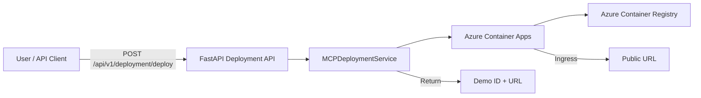
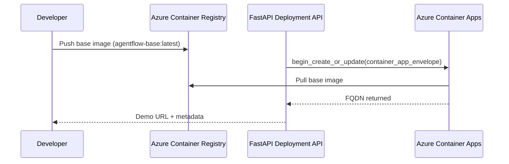
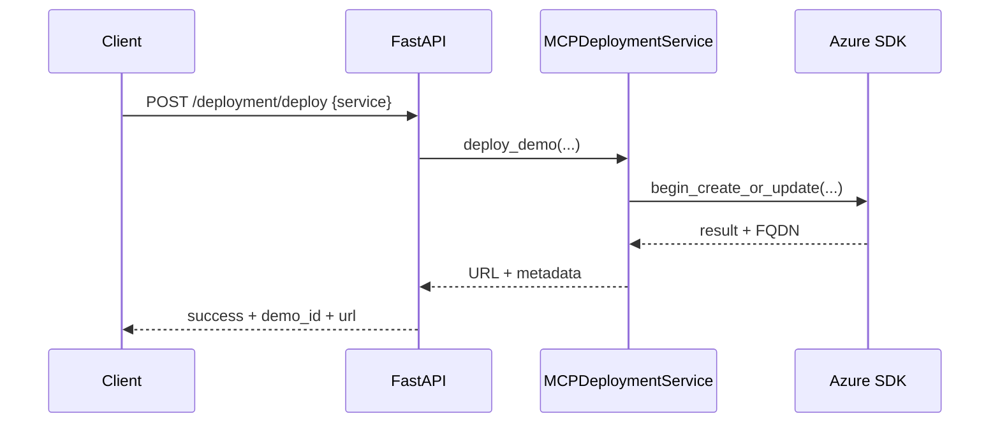

# Auto-Deployment Mechanism (Azure)

This document explains how auto-deployment is implemented in this repository using Azure Container Apps, a base Docker image hosted in Azure Container Registry (ACR), and a FastAPI deployment API. It focuses on the deployment flow for the two demo services (RAG and Email/Summarize), showing how they are packaged, configured, and launched.

---

## Overview

- Runtime stack combines a React frontend and a FastAPI backend packaged into a single container (see `Dockerfile`).
- Deployments are provisioned as Azure Container Apps based on a prebuilt base image stored in ACR.
- A secure REST API triggers deployments, tracks status, and handles cleanup.
- Secrets are injected via Container App configuration; non-secret configuration is passed as environment variables.



---

## Key Components

- Backend service: FastAPI app mounts multiple routers, including the deployment endpoints
  - File: app entrypoint ([main.py](app/main.py))
  - Deployment API router: ([app/api/deployment.py](app/api/deployment.py))
- Deployment service: Azure Container Apps client + image/env/secrets model
  - File: ([app/services/mcp_deployment_service.py](app/services/mcp_deployment_service.py))
- Base container image: Node-built frontend + Python backend
  - File: ([Dockerfile](Dockerfile))
- Azure agent integration (runtime tooling, not required for deployment trigger)
  - Files: ([Azure_config/azure_integration.py](Azure_config/azure_integration.py)), ([Azure_config/agentflow_functions.py](Azure_config/agentflow_functions.py))
- Optional Azure MCP connector for resource discovery/operations
  - Files: ([app/services/mcp/service.py](app/services/mcp/service.py)), ([app/services/mcp/server.py](app/services/mcp/server.py)), ([start_mcp.bat](start_mcp.bat))

---

## Container Image Strategy

The container image is built as a multi-stage image:

1. Frontend build (Node 18) creates `frontend/dist`.
2. Backend stage (Python 3.11-slim) installs dependencies and copies backend + built frontend.
3. Azure CLI is installed in the container (useful for in-container diagnostics).
4. Container runs `uvicorn main:app` on port 8000.

See ([Dockerfile](Dockerfile)) for details.

Deployment uses a prebuilt base image—configured via `AZURE_BASE_IMAGE`—pulled from ACR and deployed as a Container App. The service does not build images on-demand; it expects the base image to be present in the registry:

- `AZURE_CONTAINER_REGISTRY`: e.g., `agentflowdemosacr.azurecr.io`
- `AZURE_BASE_IMAGE`: e.g., `agentflow-base:latest`



---

## Azure Container Apps Configuration

MCPDeploymentService builds a `container_app_envelope` and calls the Azure SDK:

- Client: `azure.mgmt.appcontainers.ContainerAppsAPIClient` with `DefaultAzureCredential`
- Ingress: external, `targetPort: 8000`
- Scale: `minReplicas: 0`, `maxReplicas: 3`
- Managed Environment: provided via resource ID built from `AZURE_SUBSCRIPTION_ID`, `AZURE_RESOURCE_GROUP`, `AZURE_CONTAINER_ENV_NAME`
- Registry auth: server = `AZURE_CONTAINER_REGISTRY`, username = ACR name, password comes from secret `acr-password` backed by env `ACR_PASSWORD`

Relevant code in ([app/services/mcp_deployment_service.py](app/services/mcp_deployment_service.py)).

Returned FQDN is transformed into the public URL: `https://<fqdn>`.

---

## Configuration & Secrets

Environment variables and secrets are assembled and attached to the Container App. Examples:

- Core flags
  - `ENABLED_SERVICES`: comma list like `rag,email,summarize`
  - `APP_NAME`, `ENVIRONMENT`, `DISABLE_SSO`
- Azure AI Agent runtime
  - `Agent_Endpoint`, `Agent_id`, `Agent_Name`, `Agent_GPT_Model`
  - `AZURE_AI_PROJECT_API_KEY` via secret ref
- Azure OpenAI (if used)
  - `AZURE_OPENAI_ENDPOINT`, `AZURE_OPENAI_DEPLOYMENT_NAME`, `AZURE_OPENAI_API_VERSION`
  - `AZURE_OPENAI_API_KEY` via secret ref
- Email/Summarize (if enabled)
  - `EMAIL_SERVICE_URL`, `EMAIL_SERVICE_KEY` via secret ref
- RAG (if enabled)
  - `EMBED_ENDPOINT`, `EMBED_DEPLOYMENT`, `EMBED_MODEL`, `FAISS_INDEX_PATH`
  - `EMBED_API_KEY` via secret ref
- Auth/SSO
  - `SSO_SERVICE_URL`, `SECRET_KEY` via secret ref
- Registry auth
  - `acr-password` secret created from `ACR_PASSWORD`

Settings/aliases and defaults are declared in ([app/core/config.py](app/core/config.py)).

---

## Deployment Endpoints

Base API prefix: `/api/v1` (see `api_prefix` in settings).

- POST `/api/v1/deployment/deploy`
  - Request body:
    ```json
    {
      "service": "rag" | "email" | "both",
      "investor_id": "optional-identifier",
      "expiry_days": 7
    }
    ```
  - Response:
    ```json
    {
      "success": true,
      "demo_id": "<generated>",
      "url": "https://<fqdn>",
      "app_name": "<container-app-name>",
      "enabled_services": ["rag","email"],
      "expires_at": "<ISO8601>"
    }
    ```
- GET `/api/v1/deployment/status/{demo_id}` → return tracked status
- DELETE `/api/v1/deployment/delete/{demo_id}` → delete Container App

Implementation in ([app/api/deployment.py](app/api/deployment.py)).

---

## How the Trigger Works

1. Client calls the Deploy API with desired service set (`rag`, `email`, `both`).
2. API resolves `enabled_services` and calls `MCPDeploymentService.deploy_demo(...)`.
3. Service constructs the Container App envelope:
   - Managed environment ID
   - Image reference from ACR
   - Env vars + Secret refs
   - Ingress and scale
4. Azure SDK creates or updates the Container App; service retrieves FQDN.
5. API returns demo details to the caller.



---

## Frontend Delivery

- The built SPA is copied into the image (`frontend/dist`).
- At runtime, FastAPI mounts static assets and serves `index.html` at `/`.
- The server injects `ENABLED_SERVICES` into the page for runtime gating (see ([app/main.py](app/main.py))).

---

## Optional: Azure MCP Integration

While deployment uses the Azure SDK directly, the repo includes an Azure MCP server and connector for broader resource operations and diagnostics:

- Start MCP server via Node (`npx`) or Python wrapper:
  - ([start_mcp.bat](start_mcp.bat)) starts MCP with stdio transport
  - ([app/services/mcp/server.py](app/services/mcp/server.py)) starts MCP with HTTP transport
- Client-side service ([app/services/mcp/service.py](app/services/mcp/service.py)) exposes helpers to list subscriptions, resource groups, storage, Cosmos, search services, etc.

This is complementary and not required to trigger deployments.

---

## Prerequisites

- Azure subscription and access configured for `DefaultAzureCredential`.
- Container Apps Managed Environment exists and is referenced by name.
- ACR with the base image pushed and accessible:
  - `AZURE_CONTAINER_REGISTRY` → e.g., `agentflowdemosacr.azurecr.io`
  - `AZURE_BASE_IMAGE` → e.g., `agentflow-base:latest`
  - `ACR_PASSWORD` (admin-enabled) available to the API runtime
- Required secrets and non-secret config available to the API (via `.env` or secret store).

---

## Quick Usage

- Deploy a RAG demo:

```bash
curl -X POST \
  http://localhost:8000/api/v1/deployment/deploy \
  -H "Content-Type: application/json" \
  -d '{
    "service": "rag",
    "investor_id": "demo-user",
    "expiry_days": 7
  }'
```

- Check status:

```bash
curl http://localhost:8000/api/v1/deployment/status/<demo_id>
```

- Delete demo:

```bash
curl -X DELETE http://localhost:8000/api/v1/deployment/delete/<demo_id>
```

---

## Troubleshooting

- Image not found: Ensure the base image exists in ACR with the expected tag and that `AZURE_CONTAINER_REGISTRY` and `AZURE_BASE_IMAGE` are set correctly.
- Registry auth errors: Confirm `ACR_PASSWORD` is correct and admin access is enabled for the registry.
- Managed environment not found: Validate `AZURE_SUBSCRIPTION_ID`, `AZURE_RESOURCE_GROUP`, and `AZURE_CONTAINER_ENV_NAME`.
- Missing secrets: Check secret refs (`azure-openai-key`, `azure-ai-api-key`, `email-service-key`, `embed-api-key`, `secret-key`, `acr-password`).
- FQDN missing on create: The service fetches app details as a fallback; ensure the app is created successfully and ingress is enabled.

---

## Build & Push Base Image (ACR)

These are the common commands to build and push the base image to Azure Container Registry (ACR). Prefer `az acr login` (AAD auth) over admin passwords.

Prerequisites:
- Azure CLI logged in (`az login`) and correct subscription selected
- ACR exists (e.g., `agentflowdemosacr` → `agentflowdemosacr.azurecr.io`)

Set variables:
```bash
ACR_NAME=agentflowdemosacr
ACR_LOGIN_SERVER=${ACR_NAME}.azurecr.io
IMAGE_NAME=agentflow-base
IMAGE_TAG=latest
```

Login to ACR (AAD):
```bash
az acr login --name ${ACR_NAME}
```

Build, tag, push:
```bash
docker build -t ${IMAGE_NAME}:${IMAGE_TAG} .
docker tag ${IMAGE_NAME}:${IMAGE_TAG} ${ACR_LOGIN_SERVER}/${IMAGE_NAME}:${IMAGE_TAG}
docker push ${ACR_LOGIN_SERVER}/${IMAGE_NAME}:${IMAGE_TAG}
```

Verify the image:
```bash
az acr repository show-tags \
  --name ${ACR_NAME} \
  --repository ${IMAGE_NAME} \
  -o table
```

Notes:
- The deployment service references the image via `AZURE_CONTAINER_REGISTRY` and `AZURE_BASE_IMAGE` (e.g., `agentflowdemosacr.azurecr.io/agentflow-base:latest`).
- Avoid storing admin passwords; if you must use admin auth, enable ACR admin user and login via Docker: `docker login ${ACR_LOGIN_SERVER} -u <username> -p <password>`.

---

## Notes

- Observability libraries (Azure Monitor + OpenTelemetry) are included in dependencies for future telemetry; wiring may be added separately.
- The deployment service keeps an in-memory map of active demos; in production, move this to a persistent store.
- Scale-to-zero is enabled to control costs when demos are idle.

---

## References

- Deployment API: ([app/api/deployment.py](app/api/deployment.py))
- Deployment Service: ([app/services/mcp_deployment_service.py](app/services/mcp_deployment_service.py))
- App Settings: ([app/core/config.py](app/core/config.py))
- Container Build: ([Dockerfile](Dockerfile))
- MCP Integration (optional): ([app/services/mcp/service.py](app/services/mcp/service.py)), ([start_mcp.bat](start_mcp.bat))
