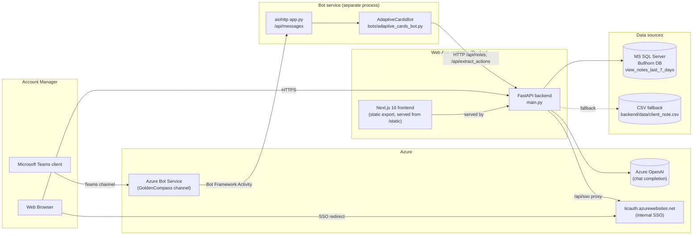
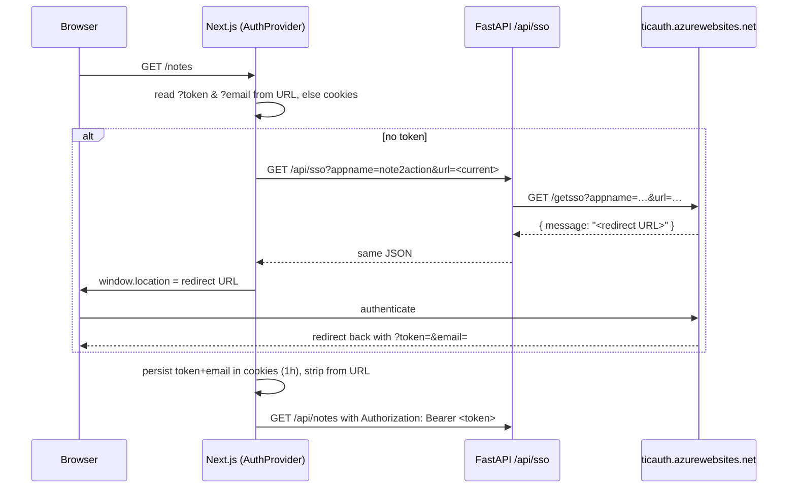
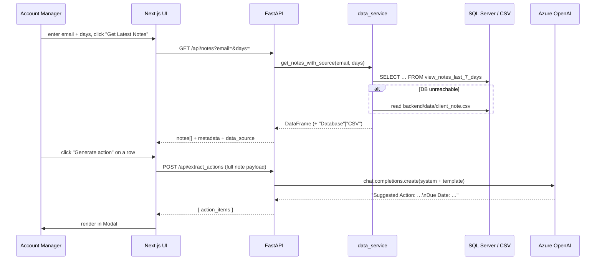
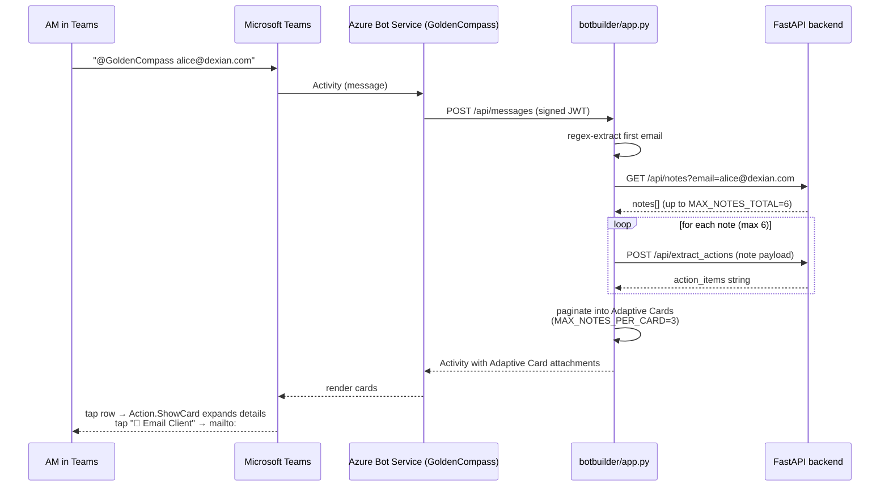

# Note‑to‑Action — Project Documentation

> An AI assistant for Account Managers (AMs) that ingests their client interaction notes, summarizes them, and surfaces the next best action — delivered both as a web app and as a Microsoft Teams bot ("GoldenCompass").

---

## 1. Problem Statement

The company employs roughly **600 Account Managers (AMs)** who collectively log **100–200 client interaction notes per week, per AM** against important stakeholders, clients, and decision‑makers. These notes are free‑form text captured in the CRM (Bullhorn) after every client visit, call, or email.

This creates three concrete pain points:

| Pain point | Impact |
|---|---|
| **Information overload** — an AM cannot re‑read hundreds of notes weekly to decide what to do next. | Follow‑ups get missed; high‑value stakeholders go cold. |
| **No structured "next action"** — notes describe what *happened*, not what *should happen next*. | Each AM has to mentally derive their own to‑do list. |
| **No reach into the AM's actual workflow** — notes live in the CRM, but AMs live in Microsoft Teams. | Even good insights don't get acted on. |

**Goal:** Automatically read every AM's recent notes, generate a concise *Suggested Action + Due Date* for each one, and push those into both a web dashboard and a Teams bot so the AM is nudged in the place they already work.

---

## 2. Approach

The system is built around a single AI pipeline with two delivery surfaces.

1. **Ingest** the AM's last *N* days of notes (default 7) from the Bullhorn SQL Server view `view_notes_last_7_days`, filtered to `action LIKE '%client visit%'` and rows with a real client contact email. A CSV fallback path exists for local/offline runs.
2. **Clean** the comments (Bullhorn stores HTML), normalize null values, and stitch client first/last name into a single field.
3. **Reason** over each note with **Azure OpenAI** using a small, deterministic prompt template (`backend/prompts.yaml`). The model returns exactly two fields: `Suggested Action` and `Due Date`.
4. **Deliver** the result through two surfaces that share the same FastAPI backend:
   - A **Next.js web dashboard** with SSO login, notes table, modal action view, and an insights page with charts.
   - A **Microsoft Bot Framework** bot (Python, aiohttp) that renders the same data as **Adaptive Cards** inside Microsoft Teams under the existing internal **GoldenCompass** bot brand.

Design principles that fell out of this:

- **Stateless backend.** Every request carries the full note context to `/api/extract_actions`; no per‑user server state. This lets both the web and Teams clients hit the same endpoint without coordination.
- **Graceful degradation.** If the database is unreachable the data service silently falls back to the CSV at [backend/data/client_note.csv](backend/data/client_note.csv); the response includes a `data_source` field so the UI can show which was used.
- **One Docker artifact for the website.** The Next.js frontend is statically exported and served *by* FastAPI, so production is a single container behind one port.
- **Bot stays separate.** The bot is its own service so it can be hosted independently and registered against Azure Bot Service / Teams without touching the web stack.

---

## 3. Architecture

### 3.1 High‑level component diagram



### 3.2 Repository layout

```
note-2-action/
├── backend/                     FastAPI service + AI pipeline
│   ├── main.py                  App entry, CORS, static SPA fallback
│   ├── config.py                Azure OpenAI + SQLAlchemy bootstrap
│   ├── prompts.yaml             System prompt + action-extraction template
│   ├── routes/
│   │   ├── notes.py             /api/notes, /api/extract_actions, /api/test
│   │   ├── stats.py             /api/am_stats (summary + per-note list)
│   │   └── auth.py              /api/sso (server-side proxy to ticauth)
│   ├── services/
│   │   ├── ai_service.py        PromptManager + ActionExtractionService
│   │   └── data_service.py      DB query + CSV fallback + HTML cleaning
│   └── data/client_note.csv     Offline fallback dataset
│
├── frontend/                    Next.js 16 + React 19 + Tailwind
│   └── app/
│       ├── page.tsx             Landing (email entry → /notes)
│       ├── login/               Login route
│       ├── notes/               Notes table + action-item modal
│       ├── insights/            Charts + AM summary
│       ├── components/          AuthProvider, AuthGuard, Summary,
│       │                         NotesTable, Modal, ActionDistribution,
│       │                         DailyTimeline, Skeletons, LogoutButton
│       ├── services/api.ts      Typed fetch wrappers to /api/*
│       └── utils/sso.ts         SSO redirect helper
│
├── botbuilder/                  Microsoft Bot Framework v4 (Python)
│   ├── app.py                   aiohttp host, CloudAdapter, /api/messages
│   ├── config.py                MicrosoftAppId / Password / TenantId / Type
│   └── bots/adaptive_cards_bot.py   Email-driven Adaptive Card builder
│
├── Dockerfile                   Multi-stage: node build → python runtime
├── docker-compose.yml           Single "app" service on :8000
└── deployment.txt               ACR push commands (ticketllmbasic.azurecr.io)
```

### 3.3 Backend API surface

All endpoints are mounted under `/api` (see [backend/main.py](backend/main.py#L42-L44)).

| Method | Path | Purpose |
|---|---|---|
| `GET`  | `/api/notes?email=&days=` | Returns the AM's notes for the last *N* days (1–30), plus aggregate metadata (`total_count`, `unique_client_email_count`, date range, `data_source`). |
| `POST` | `/api/extract_actions` | Takes a single note payload, calls Azure OpenAI, returns `{ action_items: "Suggested Action: …\nDue Date: …" }`. |
| `GET`  | `/api/am_stats?email=&days=` | AM summary block (name, department, total notes, top client) + the underlying notes list, used by the Insights page. |
| `GET`  | `/api/sso?appname=&url=` | Server‑side proxy to `https://ticauth.azurewebsites.net/getsso` (avoids browser CORS). |
| `GET`  | `/api/test?message=` | Health/liveness check that also exercises auto‑reload. |
| `GET`  | `/{path:path}` | SPA fallback — serves the exported Next.js `index.html` for any non‑API route. |

### 3.4 AI prompt design

The prompt is intentionally tiny and constrained (see [backend/prompts.yaml](backend/prompts.yaml)):

- **System message** frames the model as a *friendly notification system*, not a task commander.
- **Template** injects AM name + occupation + department, client name + occupation + email, action type, date, and the cleaned note body.
- The model is told to return only two fields and to return `"N/A"` when it cannot infer anything useful.
- Call settings: `temperature=0.3`, `max_tokens=500` — favors determinism so the same note produces stable suggestions across reruns.

### 3.5 Authentication / SSO flow



The frontend wraps every protected route in `AuthGuard`, which reads the auth state exposed by `AuthProvider` ([frontend/app/components/AuthProvider.tsx](frontend/app/components/AuthProvider.tsx)).

### 3.6 Data flow for one action item



---

## 4. Tools and Frameworks

### Backend
- **Python 3.11**, **FastAPI**, **Uvicorn** (ASGI) — see [backend/requirements.txt](backend/requirements.txt)
- **Azure OpenAI** via the `openai` SDK (`AzureOpenAI` client, API version `2024-12-01-preview`)
- **SQLAlchemy** + **pyodbc** + **msodbcsql18** (Debian 12 ODBC driver, installed in the Dockerfile)
- **pandas** for DataFrame shaping, **BeautifulSoup4** for stripping HTML out of Bullhorn `comments`
- **PyYAML** for prompt configuration, **python‑decouple** for env vars, **httpx** for the SSO proxy

### Frontend
- **Next.js 16** with **React 19**, configured for **static export** (`output: 'export'` in [frontend/next.config.ts](frontend/next.config.ts))
- **TypeScript 5**, **Tailwind CSS 3**
- **recharts** for the Insights charts (`ActionDistribution`, `DailyTimeline`)
- **axios** + native `fetch`, **js-cookie** for token/email persistence

### Bot
- **Microsoft Bot Framework SDK v4 for Python** — `botbuilder-integration-aiohttp`, `CloudAdapter`, `ConfigurationBotFrameworkAuthentication`
- **aiohttp** web server on port `3978`, endpoint `/api/messages`
- **Adaptive Cards** v1.0 schema, built programmatically in [botbuilder/bots/adaptive_cards_bot.py](botbuilder/bots/adaptive_cards_bot.py)

### Infrastructure / DevOps
- **Docker** multi‑stage build ([Dockerfile](Dockerfile)) — Node 20 alpine for `next build`, then Python 3.11‑slim runtime that copies the static export into `./static`
- **docker‑compose** ([docker-compose.yml](docker-compose.yml)) — one `app` service on port 8000
- **Azure Container Registry** — `ticketllmbasic.azurecr.io/note2action-app` (see [deployment.txt](deployment.txt))
- **Azure Bot Service** — channel registration that bridges the bot to Microsoft Teams (GoldenCompass)
- **Internal SSO** — `ticauth.azurewebsites.net` (Dexian shared auth service)

---

## 5. How It Works — End‑to‑End Flow

### 5.1 Web app flow

1. The AM opens the site. `AuthProvider` checks for `token` + `email` in the URL or cookies. If absent, it calls `/api/sso`, which proxies the internal `ticauth` service and returns a redirect URL. The AM authenticates and lands back on the app with `?token=&email=`, which is moved into cookies (1‑hour expiry) and stripped from the URL.
2. On the landing page ([frontend/app/components/MainApp.tsx](frontend/app/components/MainApp.tsx)) the AM enters their email and clicks **Get Notes** → routed to `/notes?email=…`.
3. `NotesPageContent` auto‑calls `fetchNotes(email, days)` → `GET /api/notes`. The backend pulls the last *N* days from `view_notes_last_7_days` (filtered to client visits with a real contact email), HTML‑cleans the comments, and returns the list plus aggregate metadata.
4. The user sees a `Summary` block (AM name, department, total notes, unique clients, date range) and a `NotesTable`. Clicking a row opens a `Modal` and triggers `generateActionItems(note)` → `POST /api/extract_actions`, which round‑trips through Azure OpenAI and returns the `Suggested Action` + `Due Date` string.
5. The Insights page (`/insights?email=…`) calls `/api/am_stats` and visualizes the dataset using `ActionDistribution` (pie/bar) and `DailyTimeline` (line) from `recharts`. It also has a progressive‑loaded detail table (5 rows per chunk).

### 5.2 Teams bot flow



Each Adaptive Card page contains:
- A header with an avatar derived from the email, the AM's "name" (`first.last`), and a `page_num/total_pages` indicator.
- A row per note showing client name + department and a truncated suggested action.
- An `Action.ShowCard` per row that expands into a `FactSet` (client, department, email, due date) plus the full suggested action and a `mailto:` action.

### 5.3 Running locally

```powershell
# Backend
cd backend
python -m venv venv
.\venv\Scripts\activate
python -m pip install -r requirements.txt
python -m uvicorn main:app --host 0.0.0.0 --port 8000 --reload
# Swagger UI: http://localhost:8000/docs

# Frontend (separate terminal)
cd frontend
npm install
npm run dev          # http://localhost:3000

# Bot (separate terminal)
cd botbuilder
python -m venv venv
.\venv\Scripts\activate
python -m pip install -r requirements.txt
python app.py        # http://localhost:3978/api/messages
```

### 5.4 Required environment variables

`backend/.env`:

| Variable | Purpose |
|---|---|
| `AZURE_API_KEY`, `AZURE_ENDPOINT`, `AZURE_API_VERSION`, `AZURE_MODEL` (or `AZURE_DEPLOYMENT`) | Azure OpenAI client |
| `DB_SERVER`, `DB_DATABASE`, `DB_USERNAME`, `DB_PASSWORD`, `DB_DRIVER` | Bullhorn SQL Server connection |
| `DATA_SOURCE` | `"DB"` (default) or `"CSV"` to force the offline source |

`botbuilder` environment:

| Variable | Purpose |
|---|---|
| `MicrosoftAppId` | App registration client ID |
| `MicrosoftAppPassword` | Client secret |
| `MicrosoftAppType` | `MultiTenant` (default), `SingleTenant`, or `UserAssignedMSI` |
| `MicrosoftAppTenantId` | Required for `SingleTenant`/`UserAssignedMSI` |

### 5.5 Build and deploy

```powershell
docker compose up --build                                       # local one-shot
# or push to ACR (see deployment.txt)
az login --tenant disys.onmicrosoft.com
az acr login -n ticketllmbasic.azurecr.io
docker build -t note2action .
docker tag note2action ticketllmbasic.azurecr.io/note2action-app:0.0.9
docker push ticketllmbasic.azurecr.io/note2action-app:0.0.9
```

---

## 6. Connecting the Bot to Microsoft Teams via GoldenCompass

**GoldenCompass** is the internal Microsoft Teams bot brand the company already uses to surface AI helpers to employees. "Connecting the botbuilder to Teams via GoldenCompass" means registering this Bot Framework app as a new capability behind the existing GoldenCompass bot identity so the AMs interact with one familiar bot instead of installing yet another one.

There are two equivalent ways to wire it up. Pick one.

### Option A — Reuse the existing GoldenCompass App Registration (recommended)

1. **Get the GoldenCompass app credentials** from the Azure AD admin: `MicrosoftAppId`, `MicrosoftAppPassword`, `MicrosoftAppTenantId`, and `MicrosoftAppType` (`SingleTenant` for an internal‑only Teams deployment, `MultiTenant` otherwise).
2. **Set them on the bot service** (env vars or App Service application settings — see [botbuilder/config.py](botbuilder/config.py)).
3. **Host the bot at a public HTTPS endpoint**, e.g. Azure App Service or an Azure Container Apps instance running `python app.py`. The Bot Framework requires HTTPS and a publicly reachable URL for `/api/messages`.
4. **Update the GoldenCompass Bot resource in Azure** (`Azure Bot` or `Bot Channels Registration`) so that its **messaging endpoint** points at `https://<your-bot-host>/api/messages`.
5. **Confirm the Microsoft Teams channel is enabled** on that Bot resource (Azure Portal → your Bot → *Channels* → *Microsoft Teams*). GoldenCompass should already have this enabled.
6. **Inside the GoldenCompass Teams app manifest**, add (or update) a `bots[].commandLists` entry advertising the new capability, e.g.:
   ```json
   {
     "title": "Next actions",
     "description": "Show next action items for an AM email"
   }
   ```
   Increment the manifest `version`, repackage the `.zip` (`manifest.json` + icons), and re‑upload via Teams Admin Center → *Manage apps*. Existing users get the update automatically.
7. **Validate** by `@GoldenCompass alice@dexian.com` in any Teams chat or channel where the app is installed. The bot extracts the first email from the message, calls the FastAPI backend, and replies with the paginated Adaptive Cards.

### Option B — Stand up a fresh Bot resource and link it under GoldenCompass

Use this if the team prefers isolation (separate credentials, separate App Insights, separate quotas):

1. **Create an Azure AD App Registration** for `note2action-bot` and generate a client secret.
2. **Create an *Azure Bot* resource** in the same subscription/tenant; point its messaging endpoint at your hosted bot.
3. **Enable the Microsoft Teams channel** on that Azure Bot.
4. **Add this bot as an additional bot inside the GoldenCompass Teams app manifest** (`bots[]` array supports multiple `botId`s), or publish it as a sibling app in the same GoldenCompass app catalog entry. The end user still types `@GoldenCompass …` if you keep the same display name, but routing happens to the new `botId`.
5. **Set the matching env vars** on the bot host and roll out.

### Network / data plane between the bot and the backend

The current code in [botbuilder/bots/adaptive_cards_bot.py](botbuilder/bots/adaptive_cards_bot.py#L94-L96) calls `http://localhost:8000/api/notes` and `/api/extract_actions`. Before deploying:

- Replace `localhost:8000` with the deployed backend URL (e.g. `https://note2action.<your-domain>/api`), or run the bot container in the **same App Service** / Container Apps environment as the backend so `localhost` continues to work.
- If the backend requires the SSO bearer token, add an `Authorization` header in `_get_notes_data` / `_extract_actions`. Today the backend's `/api/notes` and `/api/extract_actions` do not enforce auth, so the bot works out‑of‑the‑box; tighten this before production exposure.

### End‑to‑end conversation a user actually sees

1. AM opens Teams, navigates to the **GoldenCompass** chat.
2. Types `find next actions for kate.long@dexian.com`.
3. Within seconds, GoldenCompass replies with **"Action Items for kate.long — Page 1/2"** containing 3 collapsible rows.
4. AM taps a row → the card expands inline showing client, department, email, due date, and the full suggested action.
5. AM taps **📧 Email Client** → Teams hands off to Outlook with the recipient pre‑filled.

---

## 7. Things Worth Calling Out (Portfolio Talking Points)

- **Production‑grade resiliency without complexity.** The DB → CSV fallback ([backend/services/data_service.py](backend/services/data_service.py#L156-L194)) means a CRM outage degrades to read‑only stale data instead of a 500; the API even tells the UI which source it used.
- **One container, two surfaces.** The same FastAPI process serves the JSON API *and* the statically exported Next.js bundle (`output: 'export'`), which keeps prod infra trivial: one image, one port, one health check.
- **Deterministic LLM contract.** The prompt is locked to two output fields with `temperature=0.3`, making downstream parsing in both the web `Modal` and the bot's `_parse_action_items` regex‑free and stable.
- **Meeting users where they live.** Rather than forcing AMs to log into yet another dashboard, the same backend powers a Microsoft Teams bot through Adaptive Cards under an existing internal brand (**GoldenCompass**) — adoption cost is essentially zero.
- **Scale framing.** ~600 AMs × ~150 notes/week = roughly **90,000 notes/week** processed; each `/api/extract_actions` call is ≤ 500 tokens output, which is what kept the Azure OpenAI bill predictable.
- **Security posture.** SSO via the internal `ticauth` service, server‑side proxy to avoid exposing the SSO contract to the browser, cookie‑based session (1‑hour expiry), bot authenticated through `CloudAdapter` + Microsoft App ID/Password against Azure Bot Service.
- **Stack breadth in one repo.** Python (FastAPI + Bot Framework), TypeScript (Next.js 16 / React 19), Tailwind, SQL Server, Azure OpenAI, Docker multi‑stage, ACR — useful as a single portfolio example demonstrating full‑stack + AI + bot + cloud.

---

## 8. Assumptions Made While Writing This Doc

I documented what's verifiable in the repo. The following were inferred from your prompt and standard practice — flag any that are wrong and I'll correct them:

- "GoldenCompass" is treated as your existing internal Teams bot identity that this new capability plugs into; the repo itself doesn't reference it by name.
- The Bullhorn SQL view name (`view_notes_last_7_days`) and the `client visit` filter are taken straight from [backend/services/data_service.py](backend/services/data_service.py#L19-L41).
- The "~600 AMs / 100–200 notes per week" scale figures come from your prompt, not the code.
- The SSO provider URL (`https://ticauth.azurewebsites.net/getsso`) is taken from [backend/routes/auth.py](backend/routes/auth.py#L17-L23); I described it as an internal Dexian SSO service based on the `disys.onmicrosoft.com` tenant in [deployment.txt](deployment.txt).
