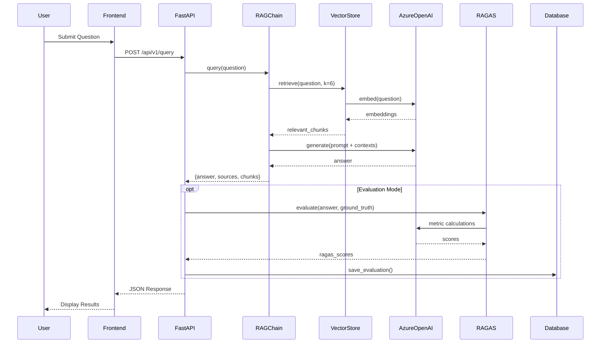

# DemoFactory - Legal RAG Application
## Comprehensive Technical Documentation

**Project:** Legal RAG (Retrieval-Augmented Generation) System  
**Repository:** Dexian-TIC/Demofactory  
**Branch:** nipu_dspyoptimize  
**Last Updated:** February 26, 2026  

---
"""You are an expert legal assistant specializing in Access to Information law. Use the following legal context to answer the question accurately.
 
IMPORTANT INSTRUCTIONS:
- Base your answer ONLY on the provided context from the Model Inter-American Law on Access to Public Information
- Cite specific Articles when making legal conclusions (e.g., "According to Article 27...")
- If the context doesn't contain enough information to answer definitively, state what is known and what is unclear
- Do not make up legal provisions or Articles that aren't in the context
- Be precise and concise in legal terminology
 
 
email : mehedi.nipu@northsouth.edu
portfolio : https://notmeher.github.io/
## Table of Contents

1. [Executive Summary](#1-executive-summary)
2. [System Architecture](#2-system-architecture)
3. [Technology Stack](#3-technology-stack)
4. [Project Structure](#4-project-structure)
5. [Backend Services](#5-backend-services)
6. [API Reference](#6-api-reference)
7. [Frontend Application](#7-frontend-application)
8. [Data Pipeline](#8-data-pipeline)
9. [Evaluation Framework](#9-evaluation-framework)
10. [DSPy Optimization](#10-dspy-optimization)
11. [Database Schema](#11-database-schema)
12. [Configuration](#12-configuration)
13. [Deployment](#13-deployment)
14. [Environment Setup](#14-environment-setup)
15. [Testing & Validation](#15-testing--validation)
16. [Performance Metrics](#16-performance-metrics)
17. [Troubleshooting](#17-troubleshooting)

---

## 1. Executive Summary

### 1.1 Purpose

DemoFactory is an advanced **Legal RAG (Retrieval-Augmented Generation) application** designed to provide intelligent question-answering capabilities for legal documents, specifically focused on **Access to Information Law** (Model Inter-American Law on Access to Public Information).

### 1.2 Key Features

| Feature | Description |
|---------|-------------|
| **Dual RAG Systems** | LangChain (standard) and DSPy (optimizable) implementations |
| **RAGAS Evaluation** | Comprehensive evaluation using Answer Accuracy, Context Relevance, Response Groundedness |
| **DSPy Optimization** | BootstrapFewShot and MIPROv2 optimizers for model improvement |
| **Comparison Dashboard** | Side-by-side LangChain vs DSPy performance comparison |
| **Token/Cost Tracking** | Real-time token usage and cost calculation |
| **Persistent Storage** | Azure SQL Database for evaluation history and trained models |
| **Production-Ready** | Docker containerization with health checks |

### 1.3 Core Capabilities

```
┌─────────────────────────────────────────────────────────────────────┐
│                        DemoFactory RAG System                        │
├─────────────────────────────────────────────────────────────────────┤
│                                                                      │
│  ┌──────────────┐    ┌──────────────┐    ┌──────────────────────┐   │
│  │   User       │───▶│   FastAPI    │───▶│   Vector Store       │   │
│  │   Query      │    │   Backend    │    │   (FAISS)            │   │
│  └──────────────┘    └──────────────┘    └──────────────────────┘   │
│                             │                       │                │
│                             ▼                       ▼                │
│                      ┌──────────────┐    ┌──────────────────────┐   │
│                      │  LangChain   │    │   Azure OpenAI       │   │
│                      │  or DSPy     │◀──▶│   (GPT-4.1)          │   │
│                      │  RAG Chain   │    │   (Embeddings)       │   │
│                      └──────────────┘    └──────────────────────┘   │
│                             │                                        │
│                             ▼                                        │
│                      ┌──────────────┐    ┌──────────────────────┐   │
│                      │   RAGAS      │───▶│   Azure SQL          │   │
│                      │   Evaluator  │    │   Database           │   │
│                      └──────────────┘    └──────────────────────┘   │
│                                                                      │
└─────────────────────────────────────────────────────────────────────┘
```

---

## 2. System Architecture

### 2.1 High-Level Architecture

```
┌─────────────────────────────────────────────────────────────────────────────┐
│                              CLIENT LAYER                                    │
│  ┌────────────────────────────────────────────────────────────────────────┐ │
│  │                     React + Vite Frontend                               │ │
│  │  ┌──────────────┐ ┌──────────────┐ ┌──────────────┐ ┌──────────────┐  │ │
│  │  │ Comparison   │ │ LangChain    │ │ DSPy Query   │ │ Model        │  │ │
│  │  │ Dashboard    │ │ Query View   │ │ View         │ │ Management   │  │ │
│  │  └──────────────┘ └──────────────┘ └──────────────┘ └──────────────┘  │ │
│  └────────────────────────────────────────────────────────────────────────┘ │
└─────────────────────────────────────────────────────────────────────────────┘
                                      │
                                      ▼ HTTP/REST
┌─────────────────────────────────────────────────────────────────────────────┐
│                              API LAYER                                       │
│  ┌────────────────────────────────────────────────────────────────────────┐ │
│  │                      FastAPI Application                                │ │
│  │  ┌──────────────────────────────────────────────────────────────────┐  │ │
│  │  │                    API Routes (routes.py)                         │  │ │
│  │  │  /query  /answer  /evaluate  /compare  /dspy/*  /models/*        │  │ │
│  │  └──────────────────────────────────────────────────────────────────┘  │ │
│  └────────────────────────────────────────────────────────────────────────┘ │
└─────────────────────────────────────────────────────────────────────────────┘
                                      │
                                      ▼
┌─────────────────────────────────────────────────────────────────────────────┐
│                            SERVICE LAYER                                     │
│  ┌───────────────┐ ┌───────────────┐ ┌───────────────┐ ┌───────────────┐   │
│  │  RAGChain     │ │ DSPyRAGChain  │ │ VectorStore   │ │ RAGAS         │   │
│  │  (LangChain)  │ │               │ │ Service       │ │ Evaluator     │   │
│  └───────────────┘ └───────────────┘ └───────────────┘ └───────────────┘   │
│  ┌───────────────┐ ┌───────────────┐ ┌───────────────┐ ┌───────────────┐   │
│  │ Document      │ │ Dataset       │ │ DSPy          │ │ Database      │   │
│  │ Loader        │ │ Matcher       │ │ Optimizer     │ │ Service       │   │
│  └───────────────┘ └───────────────┘ └───────────────┘ └───────────────┘   │
└─────────────────────────────────────────────────────────────────────────────┘
                                      │
                                      ▼
┌─────────────────────────────────────────────────────────────────────────────┐
│                             DATA LAYER                                       │
│  ┌───────────────────────┐  ┌────────────────────┐  ┌────────────────────┐  │
│  │     FAISS Index       │  │   Azure SQL DB     │  │   PDF Documents    │  │
│  │   (Vector Store)      │  │   (Evaluations,    │  │   (Knowledge       │  │
│  │                       │  │    Models)         │  │    Base)           │  │
│  └───────────────────────┘  └────────────────────┘  └────────────────────┘  │
└─────────────────────────────────────────────────────────────────────────────┘
                                      │
                                      ▼
┌─────────────────────────────────────────────────────────────────────────────┐
│                           EXTERNAL SERVICES                                  │
│  ┌────────────────────────────────┐  ┌────────────────────────────────────┐ │
│  │       Azure OpenAI             │  │       Azure SQL Database           │ │
│  │  • GPT-4.1 (LLM)               │  │  • demofactory schema              │ │
│  │  • text-embedding-3-large      │  │  • evaluation_runs                 │ │
│  │    (3072 dimensions)           │  │  • evaluation_results              │ │
│  │                                │  │  • dspy_optimized_models           │ │
│  └────────────────────────────────┘  └────────────────────────────────────┘ │
└─────────────────────────────────────────────────────────────────────────────┘
```

### 2.2 Request Flow

```
User Query → FastAPI Router → Service Layer → Vector Store (Retrieval)
                                    ↓
                           Azure OpenAI (Generation)
                                    ↓
                           Response Formation
                                    ↓
                     Optional: RAGAS Evaluation → Database Storage
                                    ↓
                           JSON Response → User
```

### 2.3 Component Interactions



---

## 3. Technology Stack

### 3.1 Backend Technologies

| Category | Technology | Version | Purpose |
|----------|------------|---------|---------|
| **Runtime** | Python | 3.12+ | Primary language |
| **Framework** | FastAPI | 0.115.0 | REST API framework |
| **Server** | Uvicorn | 0.32.0 | ASGI server |
| **RAG Framework** | LangChain | 0.3.13 | Standard RAG implementation |
| **DSPy Framework** | DSPy | Latest | Optimizable RAG implementation |
| **Vector Store** | FAISS-CPU | 1.9.0 | Similarity search |
| **Embeddings** | Azure OpenAI | - | text-embedding-3-large |
| **LLM** | Azure OpenAI | GPT-4.1 | Response generation |
| **Evaluation** | RAGAS | 0.4+ | RAG evaluation metrics |
| **Database** | Azure SQL | - | Persistent storage |
| **PDF Processing** | PyPDF | 5.1.0 | Document extraction |
| **Validation** | Pydantic | 2.10.0 | Data validation |

### 3.2 Frontend Technologies

| Category | Technology | Version | Purpose |
|----------|------------|---------|---------|
| **Runtime** | Node.js | 20.x | JavaScript runtime |
| **Framework** | React | 18.x | UI framework |
| **Build Tool** | Vite | Latest | Development & bundling |
| **HTTP Client** | Fetch API | Native | API communication |
| **Styling** | CSS | - | Component styling |

### 3.3 Infrastructure Technologies

| Category | Technology | Purpose |
|----------|------------|---------|
| **Containerization** | Docker | Application packaging |
| **Orchestration** | Docker Compose | Multi-service management |
| **Database Driver** | ODBC Driver 18 | SQL Server connectivity |
| **Async DB** | aioodbc | Async database operations |

### 3.4 Dependencies (`pyproject.toml`)

```toml
[project]
name = "dspy"
version = "0.1.0"
requires-python = ">=3.12.9"
dependencies = [
    "docx2txt==0.8",
    "faiss-cpu==1.9.0",
    "fastapi==0.115.0",
    "langchain==0.3.13",
    "langchain-community==0.3.13",
    "langchain-openai==0.2.10",
    "numpy==1.26.4",
    "pydantic==2.10.0",
    "pypdf==5.1.0",
    "python-dotenv==1.0.1",
    "ragas>=0.4.0",
    "uvicorn==0.32.0",
]
```

---

## 4. Project Structure

### 4.1 Directory Layout

```
Demofactory/
├── 📄 pyproject.toml              # Python project configuration
├── 📄 Dockerfile                  # Multi-stage Docker build
├── 📄 docker-compose.yml          # Container orchestration
├── 📄 .env.example                # Environment template
├── 📄 compare_evaluation.json     # Evaluation results (legacy)
├── 📄 DOCKER_QUICKSTART.md        # Docker setup guide
├── 📄 DSPy.md                     # DSPy documentation
├── 📄 DSPY_example.md             # DSPy examples
│
├── 📁 rag_app/                    # Backend application
│   ├── 📄 main.py                 # FastAPI application entry
│   ├── 📄 requirements.txt        # Python dependencies
│   ├── 📄 README.md               # Backend documentation
│   │
│   ├── 📁 api/                    # API layer
│   │   ├── 📄 __init__.py
│   │   └── 📄 routes.py           # API endpoints (1333 lines)
│   │
│   ├── 📁 config/                 # Configuration
│   │   ├── 📄 __init__.py
│   │   └── 📄 settings.py         # Application settings
│   │
│   ├── 📁 models/                 # Data models
│   │   ├── 📄 __init__.py
│   │   └── 📄 schemas.py          # Pydantic schemas
│   │
│   ├── 📁 services/               # Business logic
│   │   ├── 📄 __init__.py
│   │   ├── 📄 rag_chain.py        # LangChain RAG (191 lines)
│   │   ├── 📄 dspy_rag_chain.py   # DSPy RAG (255 lines)
│   │   ├── 📄 vector_store.py     # FAISS operations (209 lines)
│   │   ├── 📄 document_loader.py  # PDF processing
│   │   ├── 📄 ragas_evaluator.py  # RAGAS evaluation (202 lines)
│   │   ├── 📄 dataset_matcher.py  # Q&A matching (141 lines)
│   │   ├── 📄 dspy_optimizer.py   # DSPy training (698 lines)
│   │   ├── 📄 dspy_signatures.py  # DSPy type definitions
│   │   ├── 📄 dspy_training_data.py  # Training data management
│   │   └── 📄 database_service.py # Azure SQL operations (887 lines)
│   │
│   └── 📁 data/                   # Data storage
│       ├── 📄 metadata.json       # Index metadata
│       └── 📁 faiss_index/        # Vector index
│           └── 📄 index.faiss
│
├── 📁 rag_frontend/               # Frontend application
│   ├── 📄 package.json            # Node.js dependencies
│   ├── 📄 vite.config.js          # Vite configuration
│   ├── 📄 index.html              # HTML entry point
│   ├── 📄 FRONTEND_README.md      # Frontend documentation
│   │
│   ├── 📁 src/                    # Source code
│   │   ├── 📄 main.jsx            # React entry point
│   │   ├── 📄 App.jsx             # Main application
│   │   ├── 📄 App.css             # Global styles
│   │   ├── 📄 index.css           # Base styles
│   │   │
│   │   ├── 📁 components/         # UI components
│   │   │   ├── 📄 Header.jsx/.css
│   │   │   ├── 📄 TabNavigation.jsx/.css
│   │   │   ├── 📄 QueryForm.jsx/.css
│   │   │   ├── 📄 AnswerDisplay.jsx/.css
│   │   │   ├── 📄 LangChainQueryView.jsx/.css
│   │   │   ├── 📄 DSPyQueryView.jsx/.css
│   │   │   ├── 📄 ComparisonDashboard.jsx/.css
│   │   │   ├── 📄 EvaluationView.jsx/.css
│   │   │   └── 📄 ModelManagement.jsx/.css
│   │   │
│   │   └── 📁 services/           # API services
│   │       └── 📄 api.js          # API client (171 lines)
│   │
│   └── 📁 public/                 # Static assets
│       └── 📄 compare_evaluation.json
│
├── 📁 Ragas/                      # Evaluation data
│   ├── 📄 ATI_50_QA.json          # 50 Q&A pairs for evaluation
│   ├── 📄 RAGAS_DOCUMENTATION.md
│   ├── 📄 ragas_migration_v04.md
│   ├── 📄 ragas-metrics-documentation.md
│   └── 📄 DSPY_INTEGRATION.md
│
├── 📁 database/                   # Database scripts
│   └── 📄 schema.sql              # Azure SQL schema (431 lines)
│
├── 📁 scripts/                    # Utility scripts
│   ├── 📄 create_database_schema.py
│   ├── 📄 migrate_json_to_sql.py
│   └── 📄 update_database_schema.py
│
├── 📁 Rag_doc/                    # Knowledge base documents
│   └── 📄 Access_Model_Law_Book_English.pdf
│
└── 📁 Ui_example/                 # UI mockups/examples
```

### 4.2 Code Statistics

| Component | Files | Lines of Code |
|-----------|-------|---------------|
| API Routes | 1 | ~1,333 |
| Services | 10 | ~2,783 |
| Models/Schemas | 1 | ~100 |
| Database Schema | 1 | ~431 |
| Frontend Components | 10 | ~1,500 |
| **Total** | **~23** | **~6,147** |

---

## 5. Backend Services

### 5.1 RAGChain Service (LangChain Implementation)

**File:** `rag_app/services/rag_chain.py`

```python
class RAGChain:
    """Service for RAG chain operations using LangChain"""
    
    def __init__(self, vector_store_service: VectorStoreService):
        self.vector_store_service = vector_store_service
        self.llm = self._initialize_llm()
        self.embeddings = self._initialize_embeddings()
        self.chain = None
```

#### Key Features:

1. **LLM Initialization**
   - Uses Azure OpenAI GPT-4.1
   - Temperature: 0.7
   - Max tokens: 1000

2. **Context Filtering**
   - Semantic relevance filtering (threshold: 0.75)
   - Article-aware boosting (1.2x for chunks containing "Article")
   - Cosine similarity calculation

3. **Prompt Template**
   ```python
   template = """You are an expert legal assistant specializing in Access to Information law...
   
   Context from Legal Document:
   {context}

   Question: {question}

   Legal Answer: """
   ```

4. **Query Method**
   ```python
   def query(self, question: str, top_k: int = None) -> Dict:
       # 1. Retrieve documents
       # 2. Filter by relevance
       # 3. Generate answer
       # 4. Return {answer, sources, retrieved_chunks}
   ```

### 5.2 DSPyRAGChain Service

**File:** `rag_app/services/dspy_rag_chain.py`

```python
class RAGModule(dspy.Module):
    """Trainable DSPy Module for end-to-end RAG"""
    
    def __init__(self, vector_store_service: VectorStoreService):
        super().__init__()
        self.vector_store_service = vector_store_service
        self.answer_generator = dspy.ChainOfThought(GenerateAnswer)
    
    def forward(self, question: str) -> dspy.Prediction:
        # Retrieve contexts
        # Generate answer with Chain-of-Thought
        return prediction
```

#### DSPy Signatures

```python
class GenerateSearchQuery(dspy.Signature):
    """Generate optimized search query for legal document retrieval"""
    question = dspy.InputField(desc="User's original question")
    query = dspy.OutputField(desc="Optimized search query")

class GenerateAnswer(dspy.Signature):
    """Answer questions about Access to Information law"""
    context = dspy.InputField(desc="Relevant legal provisions")
    question = dspy.InputField(desc="User's question")
    answer = dspy.OutputField(desc="Detailed legal answer with Article citations")
```

#### Key Features:

1. **Query Optimization**
   - Uses `ChainOfThought` for query reformulation
   - Extracts key legal concepts and article numbers

2. **Trainable Module**
   - Compatible with BootstrapFewShot
   - Compatible with MIPROv2
   - Custom deep copy handling for vector store

3. **Azure OpenAI Integration**
   ```python
   lm = dspy.LM(
       model=f"azure/{settings.AZURE_OPENAI_DEPLOYMENT_NAME}",
       api_key=settings.AZURE_OPENAI_API_KEY,
       api_base=settings.AZURE_OPENAI_ENDPOINT,
       api_version=settings.AZURE_OPENAI_API_VERSION
   )
   ```

### 5.3 VectorStoreService

**File:** `rag_app/services/vector_store.py`

```python
class VectorStoreService:
    """Service for managing FAISS vector store"""
    
    def __init__(self):
        self.embeddings = self._initialize_embeddings()
        self.vector_store: Optional[FAISS] = None
        self.index_path = settings.FAISS_INDEX_PATH
        self.metadata_path = os.path.join(os.path.dirname(self.index_path), "metadata.json")
```

#### Key Methods:

| Method | Purpose |
|--------|---------|
| `create_vector_store(documents)` | Create new FAISS index from documents |
| `save_vector_store()` | Persist index to disk |
| `load_vector_store()` | Load existing index |
| `get_retriever(k)` | Get retriever with specified k |
| `compute_document_hash(path)` | SHA256 hash for change detection |
| `has_document_changed(path)` | Check if reindexing needed |
| `save_metadata(...)` | Save index metadata |
| `load_metadata()` | Load index metadata |

#### Embeddings Configuration:

```python
embeddings = AzureOpenAIEmbeddings(
    azure_endpoint=settings.EMBED_ENDPOINT,
    api_key=settings.EMBED_API_KEY,
    api_version=settings.EMBED_API_VERSION,
    azure_deployment=settings.EMBED_DEPLOYMENT,
    model=settings.EMBED_MODEL,  # text-embedding-3-large
    dimensions=settings.EMBED_DIMENSIONS  # 3072
)
```

### 5.4 RAGASEvaluator Service

**File:** `rag_app/services/ragas_evaluator.py`

```python
class RAGASEvaluator:
    """Service for RAGAS evaluation metrics using RAGAS v0.4+ API"""
    
    def __init__(self):
        # Wrap LangChain LLM for RAGAS v0.4
        self.llm = LangchainLLMWrapper(azure_llm)
        
        # Initialize metrics
        self.answer_accuracy = AnswerAccuracy(llm=self.llm)
        self.context_relevance = ContextRelevance(llm=self.llm)
        self.response_groundedness = ResponseGroundedness(llm=self.llm)
```

#### Metrics Explained:

| Metric | Description | Score Range |
|--------|-------------|-------------|
| **Answer Accuracy** | Agreement between model response and ground truth | 0.0 - 1.0 |
| **Context Relevance** | Relevance of retrieved contexts to user query | 0.0 - 1.0 |
| **Response Groundedness** | How well response is supported by contexts | 0.0 - 1.0 |
| **Average Score** | Mean of all three metrics | 0.0 - 1.0 |

#### Rate Limit Handling:

```python
async def evaluate_with_retry(self, ..., max_retries: int = 5):
    """Evaluate with exponential backoff for rate limits"""
    base_delay = 2
    
    for attempt in range(max_retries):
        try:
            return await self.evaluate(...)
        except RateLimitError as e:
            retry_after = self._parse_retry_after(str(e))
            delay = max(retry_after, base_delay * (2 ** attempt))
            await asyncio.sleep(delay)
```

### 5.5 DocumentLoader Service

**File:** `rag_app/services/document_loader.py`

```python
class DocumentLoader:
    """Service for loading and processing documents"""
    
    def __init__(self):
        self.knowledge_base_path = settings.KNOWLEDGE_BASE_PATH
        self.chunk_size = settings.CHUNK_SIZE  # 1200
        self.chunk_overlap = settings.CHUNK_OVERLAP  # 300
```

#### Chunking Strategy:

```python
text_splitter = RecursiveCharacterTextSplitter(
    chunk_size=1200,
    chunk_overlap=300,
    separators=[
        "\n\n",  # Paragraph breaks
        "\n",    # Line breaks
        ". ",    # Sentence endings
        " ",     # Word breaks
        ""       # Character breaks
    ],
    keep_separator=True
)
```

#### Metadata Enrichment:

```python
for i, chunk in enumerate(chunks):
    chunk.metadata["chunk_id"] = i
    chunk.metadata["chunk_size"] = len(chunk.page_content)
    if "Article" in content:
        chunk.metadata["has_article"] = True
```

### 5.6 DatasetMatcher Service

**File:** `rag_app/services/dataset_matcher.py`

```python
class DatasetMatcher:
    """Matches questions with dataset entries using exact and semantic matching"""
    
    def __init__(self, dataset_path: str):
        self.dataset = self._load_dataset()
        self.embeddings = self._initialize_embeddings()
        self.threshold = 0.70  # Semantic similarity threshold
```

#### Matching Strategy:

1. **Exact Match** (Priority 1)
   - Case-insensitive string comparison
   - Returns immediately if found

2. **Semantic Match** (Priority 2)
   - Compute cosine similarity with all dataset questions
   - Return best match if similarity ≥ 0.70

```python
async def find_match(self, question: str) -> Optional[Dict]:
    # Step 1: Try exact match
    for entry in self.dataset['data']:
        if entry['question'].strip().lower() == question.strip().lower():
            return {**entry, 'match_method': 'exact'}
    
    # Step 2: Try semantic match
    query_embedding = await self.embeddings.aembed_query(question)
    similarities = [
        self._compute_cosine_similarity(query_embedding, q_emb)
        for q_emb in self.question_embeddings
    ]
    # Return best match if above threshold
```

### 5.7 DSPyOptimizer Service

**File:** `rag_app/services/dspy_optimizer.py`

```python
class DSPyOptimizer:
    """DSPy Optimizer Service - BootstrapFewShot and MIPROv2"""
```

#### Optimization Strategies:

**1. BootstrapFewShot (Fast)**
```python
from dspy.teleprompt import BootstrapFewShot

optimizer = BootstrapFewShot(
    metric=semantic_metric,
    max_bootstrapped_demos=4,
    max_labeled_demos=4
)
optimized_program = optimizer.compile(program, trainset=trainset)
```

**2. MIPROv2 (Thorough)**
```python
from dspy.teleprompt import MIPROv2

optimizer = MIPROv2(
    metric=semantic_metric,
    num_candidates=10,  # Optimization depth
    init_temperature=1.0
)
optimized_program = optimizer.compile(
    program, 
    trainset=trainset,
    valset=valset
)
```

#### Metrics:

**Semantic Similarity Metric:**
```python
def semantic_metric(example: dspy.Example, prediction, trace=None) -> float:
    # Get embeddings
    pred_embedding = get_embedding(prediction.answer)
    truth_embedding = get_embedding(example.ground_truth)
    
    # Calculate cosine similarity
    similarity = cosine_similarity(pred_embedding, truth_embedding)
    return float(max(0.0, min(1.0, similarity)))
```

**RAGAS Metric:**
```python
def ragas_metric(example: dspy.Example, prediction, trace=None) -> float:
    result = await evaluator.evaluate(
        question=example.question,
        generated_answer=prediction.answer,
        ground_truth=example.ground_truth,
        retrieved_contexts=contexts
    )
    return result['average_score']
```

### 5.8 DatabaseService

**File:** `rag_app/services/database_service.py`

```python
class DatabaseService:
    """Service for persisting evaluation results to Azure SQL Database"""
    
    def __init__(self):
        self.connection_string = settings.DATABASE_CONNECTION_STRING
        self.schema = settings.DB_SCHEMA  # "demofactory"
        self._pool = None
```

#### Key Methods:

| Method | Purpose |
|--------|---------|
| `initialize()` | Create connection pool |
| `close()` | Close connection pool |
| `save_evaluation_run(...)` | Save batch evaluation metadata |
| `save_evaluation_results(run_id, results)` | Save individual question results |
| `get_evaluation_history(top_n, filter)` | Get recent evaluations |
| `get_run_details(run_id)` | Get specific run details |
| `save_dspy_evaluation(...)` | Save single DSPy evaluation |
| `get_high_quality_dspy_evaluations(min_score)` | Get training data |
| `list_optimized_models(...)` | List trained models |
| `get_model_by_id(model_id)` | Get model details |
| `set_active_model(model_id)` | Activate a model |
| `delete_model(model_id)` | Remove a model |

---

## 6. API Reference

### 6.1 Base URL

```
Development: http://localhost:8000/api/v1
Production:  https://your-domain.com/api/v1
```

### 6.2 Endpoints Overview

| Method | Endpoint | Description |
|--------|----------|-------------|
| `GET` | `/health` | Health check |
| `POST` | `/query` | Full RAG query with sources |
| `POST` | `/answer` | Simple answer response |
| `POST` | `/evaluate` | LangChain + RAGAS evaluation |
| `POST` | `/dspy/answer` | DSPy RAG query |
| `POST` | `/dspy/evaluate` | DSPy + RAGAS evaluation |
| `POST` | `/compare/evaluate` | Batch comparison evaluation |
| `GET` | `/evaluation/history` | Get evaluation history |
| `GET` | `/evaluation/run/{run_id}` | Get run details |
| `GET` | `/evaluation/trends` | Get performance trends |
| `GET` | `/dspy/training-data` | Get training data info |
| `POST` | `/dspy/train` | Train DSPy model |
| `GET` | `/dspy/models` | List optimized models |
| `GET` | `/dspy/models/{model_id}` | Get model details |
| `POST` | `/dspy/models/{model_id}/activate` | Activate model |
| `DELETE` | `/dspy/models/{model_id}` | Delete model |
| `POST` | `/dspy/models/{model_id}/evaluate` | Evaluate model with RAGAS |

### 6.3 Detailed Endpoint Documentation

#### 6.3.1 Health Check

```http
GET /api/v1/health
```

**Response:**
```json
{
  "status": "healthy",
  "service": "RAG API"
}
```

---

#### 6.3.2 Query (Full Response)

```http
POST /api/v1/query
Content-Type: application/json
```

**Request:**
```json
{
  "question": "What are the requirements for public disclosure?",
  "top_k": 6
}
```

**Response:**
```json
{
  "answer": "According to Article 11, authorities must proactively disclose...",
  "sources": ["page_5", "page_12"],
  "retrieved_chunks": [
    "Article 11(1)(b) lists qualifications and salaries...",
    "Article 11(1)(m) lists disclosure log for proactive publication..."
  ]
}
```

---

#### 6.3.3 Simple Answer

```http
POST /api/v1/answer
Content-Type: application/json
```

**Request:**
```json
{
  "question": "Can anonymous requests be submitted?"
}
```

**Response:**
```json
{
  "answer": "Yes. Anonymous requests are permitted and must be processed according to Article 5(d)."
}
```

---

#### 6.3.4 LangChain Evaluation

```http
POST /api/v1/evaluate
Content-Type: application/json
```

**Request:**
```json
{
  "question": "A requester asks a municipal department for copies of awarded contracts. The department plans to charge a filing fee to submit the request. What should the department do?"
}
```

**Response:**
```json
{
  "question": "A requester asks a municipal department...",
  "generated_answer": "They must not charge a filing/request fee—access requests are free...",
  "ground_truth": "They must not charge a filing/request fee—access requests are free. Only reproduction and delivery costs may be charged...",
  "retrieved_contexts": ["Under Article 21, no fee shall be charged...", "..."],
  "reference_context": "Under Article 21, no fee shall be charged for making a request...",
  "ragas_scores": {
    "answer_accuracy": 0.95,
    "context_relevance": 0.88,
    "response_groundedness": 0.92,
    "average_score": 0.917
  },
  "match_method": "exact"
}
```

---

#### 6.3.5 DSPy Query

```http
POST /api/v1/dspy/answer
Content-Type: application/json
```

**Request:**
```json
{
  "question": "What is the deadline for responding to information requests?",
  "top_k": 6,
  "optimize_query": true
}
```

**Response:**
```json
{
  "answer": "According to Article 34, public authorities must respond within 20 working days...",
  "optimized_query": "response deadline information request working days Article 34 35",
  "sources": [
    {"page": 15, "content": "Article 34..."},
    {"page": 16, "content": "Article 35..."}
  ],
  "retrieved_chunks": ["Article 34(1) sets the response deadline...", "..."],
  "reasoning": "I analyzed the question to identify key concepts: response timeline, working days, and statutory deadlines..."
}
```

---

#### 6.3.6 Batch Comparison Evaluation

```http
POST /api/v1/compare/evaluate?num_questions=10
```

**Response:**
```json
{
  "total_questions": 10,
  "results": [
    {
      "question_index": 0,
      "question": "A requester asks a municipal department...",
      "ground_truth": "They must not charge a filing/request fee...",
      "langchain": {
        "answer": "The department should not charge...",
        "ragas_scores": {
          "answer_accuracy": 0.92,
          "context_relevance": 0.85,
          "response_groundedness": 0.88,
          "average_score": 0.883
        },
        "retrieved_contexts": ["..."]
      },
      "dspy": {
        "answer": "According to Article 21, no fee shall be charged...",
        "optimized_query": "filing fee access request Article 21 27",
        "ragas_scores": {
          "answer_accuracy": 0.95,
          "context_relevance": 0.91,
          "response_groundedness": 0.93,
          "average_score": 0.930
        },
        "retrieved_contexts": ["..."]
      },
      "winner": "dspy"
    }
  ],
  "summary": {
    "langchain_avg": {
      "answer_accuracy": 0.85,
      "context_relevance": 0.82,
      "response_groundedness": 0.84,
      "average_score": 0.837,
      "token_usage": {
        "input_tokens": 45000,
        "output_tokens": 8500,
        "total_tokens": 53500,
        "input_cost_usd": 0.09,
        "output_cost_usd": 0.068,
        "total_cost_usd": 0.158
      }
    },
    "dspy_avg": {
      "answer_accuracy": 0.89,
      "context_relevance": 0.87,
      "response_groundedness": 0.88,
      "average_score": 0.880,
      "token_usage": {
        "input_tokens": 52000,
        "output_tokens": 9800,
        "total_tokens": 61800,
        "input_cost_usd": 0.104,
        "output_cost_usd": 0.078,
        "total_cost_usd": 0.182
      }
    },
    "win_count": {
      "langchain": 2,
      "dspy": 7,
      "tie": 1
    },
    "better_method": "dspy"
  }
}
```

---

#### 6.3.7 Train DSPy Model

```http
POST /api/v1/dspy/train
Content-Type: application/json
```

**Query Parameters:**

| Parameter | Type | Default | Description |
|-----------|------|---------|-------------|
| `optimizer_type` | string | "bootstrap" | "bootstrap" or "mipro_v2" |
| `use_dynamic_data` | bool | true | Include database examples |
| `dynamic_min_score` | float | 0.90 | Minimum score for dynamic examples |
| `max_dynamic_examples` | int | 50 | Max dynamic examples to use |
| `max_bootstrapped_demos` | int | 4 | Few-shot examples to generate |
| `num_candidates` | int | 10 | MIPROv2 optimization depth |
| `train_ratio` | float | 0.7 | Train/validation split |
| `metric_type` | string | "semantic" | "semantic" or "ragas" |

**Response:**
```json
{
  "status": "success",
  "model_id": "a1b2c3d4-e5f6-7890-abcd-ef1234567890",
  "model_name": "bootstrap_20260226_143052",
  "storage": "database",
  "database_table": "demofactory.dspy_optimized_models",
  "optimizer_type": "bootstrap",
  "training_data": {
    "total_examples": 65,
    "training_examples": 45,
    "validation_examples": 20,
    "static_count": 50,
    "dynamic_count": 15
  },
  "optimization_results": {
    "validation_score": 87.5,
    "optimized_instruction": "You are an expert legal assistant...",
    "num_few_shot_demos": 4,
    "is_active": false
  },
  "optimizer_config": {
    "max_bootstrapped_demos": 4
  },
  "next_steps": [
    "Test model: GET /dspy/models/a1b2c3d4-e5f6-7890-abcd-ef1234567890",
    "Activate model: POST /dspy/models/a1b2c3d4-e5f6-7890-abcd-ef1234567890/activate",
    "Run /compare/evaluate to test performance",
    "View all models: GET /dspy/models"
  ]
}
```

---

### 6.4 Request/Response Schemas

```python
# Request Models
class QueryRequest(BaseModel):
    question: str
    top_k: int = 4

class SimpleQueryRequest(BaseModel):
    question: str

class EvaluationRequest(BaseModel):
    question: str

class DSPyQueryRequest(BaseModel):
    question: str
    top_k: int = 6
    optimize_query: bool = True

# Response Models
class QueryResponse(BaseModel):
    answer: str
    sources: list[str]
    retrieved_chunks: list[str]

class SimpleQueryResponse(BaseModel):
    answer: str

class EvaluationResponse(BaseModel):
    question: str
    generated_answer: str
    ground_truth: str
    retrieved_contexts: list[str]
    reference_context: str
    ragas_scores: dict
    match_method: str  # "exact" or "semantic"

class DSPyQueryResponse(BaseModel):
    answer: str
    optimized_query: str
    sources: list[dict]
    retrieved_chunks: list[str]
    reasoning: str = None

class TokenUsage(BaseModel):
    input_tokens: int
    output_tokens: int
    total_tokens: int
    input_cost_usd: float
    output_cost_usd: float
    total_cost_usd: float

class MethodSummary(BaseModel):
    answer_accuracy: float
    context_relevance: float
    response_groundedness: float
    average_score: float
    token_usage: TokenUsage

class ComparisonSummary(BaseModel):
    langchain_avg: MethodSummary
    dspy_avg: MethodSummary
    win_count: dict
    better_method: str

class ComparisonEvaluationResponse(BaseModel):
    total_questions: int
    results: list[QuestionComparisonResult]
    summary: ComparisonSummary
```

---

## 7. Frontend Application

### 7.1 Application Entry Point

**File:** `rag_frontend/src/App.jsx`

```jsx
import { useState } from 'react';
import TabNavigation from './components/TabNavigation';
import LangChainQueryView from './components/LangChainQueryView';
import DSPyQueryView from './components/DSPyQueryView';
import ComparisonDashboard from './components/ComparisonDashboard';
import EvaluationView from './components/EvaluationView';
import ModelManagement from './components/ModelManagement';
import Header from './components/Header';

function App() {
  const [activeTab, setActiveTab] = useState('comparison');

  const renderActiveView = () => {
    switch (activeTab) {
      case 'langchain': return <LangChainQueryView />;
      case 'dspy': return <DSPyQueryView />;
      case 'comparison': return <ComparisonDashboard />;
      case 'evaluate': return <EvaluationView />;
      case 'models': return <ModelManagement />;
      default: return <ComparisonDashboard />;
    }
  };

  return (
    <div className="app">
      <Header />
      <div className="container">
        <TabNavigation activeTab={activeTab} onTabChange={setActiveTab} />
        <div className="view-container">
          {renderActiveView()}
        </div>
      </div>
    </div>
  );
}
```

### 7.2 Component Architecture

```
App.jsx
├── Header.jsx                    # Application header/branding
├── TabNavigation.jsx             # Navigation tabs
└── View Components
    ├── ComparisonDashboard.jsx   # Side-by-side comparison (default)
    ├── LangChainQueryView.jsx    # LangChain RAG interface
    ├── DSPyQueryView.jsx         # DSPy RAG interface
    ├── EvaluationView.jsx        # Evaluation runner
    └── ModelManagement.jsx       # DSPy model management
```

### 7.3 API Service Client

**File:** `rag_frontend/src/services/api.js`

```javascript
const API_BASE_URL = '/api/v1';

export const ragApi = {
  // Simple answer endpoint
  getAnswer: async (question) => {
    const response = await fetch(`${API_BASE_URL}/answer`, {
      method: 'POST',
      headers: { 'Content-Type': 'application/json' },
      body: JSON.stringify({ question }),
    });
    return response.json();
  },

  // Detailed query endpoint with sources
  getDetailedAnswer: async (question, topK = 4) => {
    const response = await fetch(`${API_BASE_URL}/query`, {
      method: 'POST',
      headers: { 'Content-Type': 'application/json' },
      body: JSON.stringify({ question, top_k: topK }),
    });
    return response.json();
  },

  // Health check
  checkHealth: async () => {
    const response = await fetch(`${API_BASE_URL}/health`);
    return response.json();
  },

  // Get evaluation history from database
  getEvaluationHistory: async (topN = 10, betterMethod = null) => {
    let url = `${API_BASE_URL}/evaluation/history?top_n=${topN}`;
    if (betterMethod) url += `&better_method=${betterMethod}`;
    const response = await fetch(url);
    return response.json();
  },

  // DSPy Model Management
  getOptimizedModels: async () => {
    const response = await fetch(`${API_BASE_URL}/dspy/models`);
    return response.json();
  },

  activateModel: async (modelId) => {
    const response = await fetch(`${API_BASE_URL}/dspy/models/${modelId}/activate`, {
      method: 'POST'
    });
    return response.json();
  },

  deleteModel: async (modelId) => {
    const response = await fetch(`${API_BASE_URL}/dspy/models/${modelId}`, {
      method: 'DELETE'
    });
    return response.json();
  }
};
```

### 7.4 Build Configuration

**File:** `rag_frontend/vite.config.js`

```javascript
import { defineConfig } from 'vite';
import react from '@vitejs/plugin-react';

export default defineConfig({
  plugins: [react()],
  server: {
    proxy: {
      '/api': {
        target: 'http://localhost:8000',
        changeOrigin: true,
      }
    }
  },
  build: {
    outDir: 'dist',
    assetsDir: 'assets'
  }
});
```

---

## 8. Data Pipeline

### 8.1 Document Processing Pipeline

```
┌─────────────────────────────────────────────────────────────────────────────┐
│                        DOCUMENT PROCESSING PIPELINE                          │
└─────────────────────────────────────────────────────────────────────────────┘

┌──────────────────┐    ┌──────────────────┐    ┌──────────────────┐
│   PDF Document   │───▶│   PyPDFLoader    │───▶│   Raw Pages      │
│   (Legal Law)    │    │   (Extraction)   │    │   (Documents)    │
└──────────────────┘    └──────────────────┘    └──────────────────┘
                                                        │
                                                        ▼
┌──────────────────┐    ┌──────────────────┐    ┌──────────────────┐
│   FAISS Index    │◀───│   Embeddings     │◀───│   Text Chunks    │
│   (Vector Store) │    │   (Azure OpenAI) │    │   (1200 chars)   │
└──────────────────┘    └──────────────────┘    └──────────────────┘
        │
        ▼
┌──────────────────┐    ┌──────────────────┐
│   metadata.json  │    │   index.faiss    │
│   (Hash, Count)  │    │   (Vectors)      │
└──────────────────┘    └──────────────────┘
```

### 8.2 Chunking Configuration

```python
# Document Chunking Settings
CHUNK_SIZE = 1200       # Characters per chunk
CHUNK_OVERLAP = 300     # Overlap between chunks

# Separators (in priority order)
separators = [
    "\n\n",   # 1. Paragraph breaks (legal sections)
    "\n",     # 2. Line breaks (articles, provisions)
    ". ",     # 3. Sentence endings
    " ",      # 4. Word breaks
    ""        # 5. Character breaks (fallback)
]
```

### 8.3 Document Change Detection

```python
def has_document_changed(document_path: str) -> bool:
    """Check if document needs reindexing"""
    
    # Load existing metadata
    metadata = load_metadata()
    if metadata is None:
        return True  # No index exists
    
    # Compute current document hash
    current_hash = compute_document_hash(document_path)  # SHA256
    stored_hash = metadata.get("document_hash")
    
    return current_hash != stored_hash
```

### 8.4 Query Processing Pipeline

```
┌─────────────────────────────────────────────────────────────────────────────┐
│                          QUERY PROCESSING PIPELINE                           │
└─────────────────────────────────────────────────────────────────────────────┘

User Question
      │
      ▼
┌─────────────────────────────────────────────────────────────────────────────┐
│                        RETRIEVAL PHASE                                       │
│  ┌────────────────┐    ┌────────────────┐    ┌────────────────┐            │
│  │ Query          │───▶│ Embedding      │───▶│ FAISS Search   │            │
│  │ (User Input)   │    │ (3072-dim)     │    │ (Similarity)   │            │
│  └────────────────┘    └────────────────┘    └────────────────┘            │
│                                                      │                      │
│                        ┌─────────────────────────────┘                      │
│                        ▼                                                    │
│               ┌────────────────┐    ┌────────────────┐                     │
│               │ Top-K Results  │───▶│ Relevance      │                     │
│               │ (k=6)          │    │ Filtering      │                     │
│               └────────────────┘    │ (threshold=0.75)│                    │
│                                     └────────────────┘                     │
└─────────────────────────────────────────────────────────────────────────────┘
                                              │
                                              ▼
┌─────────────────────────────────────────────────────────────────────────────┐
│                        GENERATION PHASE                                      │
│  ┌────────────────┐    ┌────────────────┐    ┌────────────────┐            │
│  │ Filtered       │───▶│ Prompt         │───▶│ Azure OpenAI   │            │
│  │ Contexts       │    │ Construction   │    │ (GPT-4.1)      │            │
│  └────────────────┘    └────────────────┘    └────────────────┘            │
│                                                      │                      │
│                                                      ▼                      │
│                                             ┌────────────────┐             │
│                                             │ Legal Answer   │             │
│                                             │ with Citations │             │
│                                             └────────────────┘             │
└─────────────────────────────────────────────────────────────────────────────┘
```

### 8.5 Article-Aware Boosting

```python
def _filter_contexts_by_relevance(self, question, documents, threshold=0.75):
    """Filter with article-aware boosting"""
    
    scored_docs = []
    for doc, doc_emb in zip(documents, doc_embeddings):
        similarity = cosine_similarity(question_embedding, doc_emb)
        
        # Boost similarity for chunks containing Article references
        if "Article" in doc.page_content:
            boosted_similarity = min(similarity * 1.2, 1.0)  # 20% boost
            similarity = boosted_similarity
        
        scored_docs.append((doc, similarity))
    
    # Sort and filter
    scored_docs.sort(key=lambda x: x[1], reverse=True)
    return [doc for doc, sim in scored_docs if sim >= threshold]
```

---

## 9. Evaluation Framework

### 9.1 RAGAS v0.4 Metrics

| Metric | Description | Calculation |
|--------|-------------|-------------|
| **Answer Accuracy** | How well the generated answer matches ground truth | LLM-based semantic comparison |
| **Context Relevance** | How relevant retrieved contexts are to the query | Relevance scoring per context |
| **Response Groundedness** | How well the answer is supported by contexts | Entailment verification |
| **Average Score** | Mean of all three metrics | `(AA + CR + RG) / 3` |

### 9.2 Evaluation Dataset

**File:** `Ragas/ATI_50_QA.json`

```json
[
  {
    "question": "A requester asks a municipal department for copies of awarded contracts. The department plans to charge a filing fee to submit the request. What should the department do?",
    "ground_truth": "They must not charge a filing/request fee—access requests are free. Only reproduction and delivery costs may be charged and those must be limited to actual costs, with electronic provision free of charge.",
    "context": "Under Article 21, no fee shall be charged for making a request. Article 27 limits fees to reproduction and delivery costs only; electronic provision is free."
  },
  // ... 49 more Q&A pairs
]
```

### 9.3 Evaluation Flow

```
┌─────────────────────────────────────────────────────────────────────────────┐
│                          EVALUATION FLOW                                     │
└─────────────────────────────────────────────────────────────────────────────┘

┌──────────────┐    ┌──────────────┐    ┌──────────────┐    ┌──────────────┐
│   Question   │───▶│   RAG        │───▶│   Dataset    │───▶│   RAGAS      │
│   Input      │    │   Answer     │    │   Matcher    │    │   Evaluate   │
└──────────────┘    └──────────────┘    └──────────────┘    └──────────────┘
                           │                   │                   │
                           │                   │                   │
                    ┌──────┴───────┐    ┌─────┴─────┐       ┌─────┴─────┐
                    │ generated    │    │ ground    │       │ scores    │
                    │ answer       │    │ truth     │       │ (0.0-1.0) │
                    └──────────────┘    └───────────┘       └───────────┘
                                               │                   │
                                               ▼                   ▼
                                        ┌─────────────────────────────────┐
                                        │        COMPARISON               │
                                        │  answer_accuracy: 0.95          │
                                        │  context_relevance: 0.88        │
                                        │  response_groundedness: 0.92    │
                                        │  average_score: 0.917           │
                                        └─────────────────────────────────┘
```

### 9.4 Token & Cost Tracking

```python
# GPT-4.1 Pricing (per 1M tokens)
INPUT_PRICE_PER_1M = 2.00    # $2.00 per 1M input tokens
OUTPUT_PRICE_PER_1M = 8.00   # $8.00 per 1M output tokens

# Token Estimation
def estimate_tokens(text: str, model: str = "gpt-4") -> int:
    encoding = tiktoken.encoding_for_model(model)
    return len(encoding.encode(text))

# Cost Calculation
input_cost = (total_input_tokens / 1_000_000) * INPUT_PRICE_PER_1M
output_cost = (total_output_tokens / 1_000_000) * OUTPUT_PRICE_PER_1M
total_cost = input_cost + output_cost
```

### 9.5 Comparison Evaluation Results

**Example Output:**

```
┌────────────────────────────────────────────────────────────────────────────┐
│                    COMPARISON EVALUATION RESULTS                            │
│                         10 Questions Evaluated                              │
├────────────────────────────────────────────────────────────────────────────┤
│                                                                             │
│  METRIC               │ LANGCHAIN      │ DSPY          │ WINNER            │
│  ─────────────────────┼────────────────┼───────────────┼─────────────────  │
│  Answer Accuracy      │ 85.2%          │ 89.1%         │ DSPy (+3.9%)      │
│  Context Relevance    │ 82.4%          │ 87.3%         │ DSPy (+4.9%)      │
│  Response Groundedness│ 84.1%          │ 88.2%         │ DSPy (+4.1%)      │
│  Average Score        │ 83.7%          │ 88.0%         │ DSPy (+4.3%)      │
│  ─────────────────────┼────────────────┼───────────────┼─────────────────  │
│  Total Tokens         │ 53,500         │ 61,800        │ LangChain         │
│  Total Cost (USD)     │ $0.158         │ $0.182        │ LangChain         │
│  ─────────────────────┼────────────────┼───────────────┼─────────────────  │
│  Win Count            │ 2              │ 7             │ 1 tie             │
│                                                                             │
│  OVERALL WINNER: DSPy (4.3% higher average score)                          │
│                                                                             │
└────────────────────────────────────────────────────────────────────────────┘
```

---

## 10. DSPy Optimization

### 10.1 Training Data Sources

```
┌─────────────────────────────────────────────────────────────────────────────┐
│                        HYBRID TRAINING DATA                                  │
└─────────────────────────────────────────────────────────────────────────────┘

┌────────────────────────┐    ┌────────────────────────┐
│   STATIC SOURCE        │    │   DYNAMIC SOURCE       │
│   ATI_50_QA.json       │    │   Database Results     │
├────────────────────────┤    ├────────────────────────┤
│ • 50 curated Q&A pairs │    │ • High-quality evals   │
│ • Expert-verified      │    │   (RAGAS ≥ 90%)        │
│ • Ground truth answers │    │ • Comparison results   │
│ • Reference contexts   │    │ • Single DSPy evals    │
└────────────────────────┘    └────────────────────────┘
            │                            │
            └──────────┬─────────────────┘
                       ▼
              ┌────────────────────┐
              │   COMBINED SET     │
              │   (Weighted Mix)   │
              └────────────────────┘
                       │
           ┌───────────┴───────────┐
           ▼                       ▼
    ┌────────────┐          ┌────────────┐
    │  Training  │          │ Validation │
    │  Set (70%) │          │  Set (30%) │
    └────────────┘          └────────────┘
```

### 10.2 Optimization Strategies

#### 10.2.1 BootstrapFewShot (Fast)

```python
from dspy.teleprompt import BootstrapFewShot

# Configuration
optimizer = BootstrapFewShot(
    metric=semantic_metric,       # Scoring function
    max_bootstrapped_demos=4,     # Few-shot examples to generate
    max_labeled_demos=4,          # Max labeled examples
    max_rounds=1                  # Optimization rounds
)

# Compile
optimized_program = optimizer.compile(
    student=rag_module,           # The trainable DSPy module
    trainset=trainset             # Training examples
)
```

**Characteristics:**
- Fast optimization (~5-10 minutes)
- Generates few-shot examples
- Good for initial improvements
- Lower cost (~$2-5)

#### 10.2.2 MIPROv2 (Thorough)

```python
from dspy.teleprompt import MIPROv2

# Configuration
optimizer = MIPROv2(
    metric=semantic_metric,
    num_candidates=10,            # Optimization depth (≤5=light, ≤10=medium, >10=heavy)
    init_temperature=1.0,
    verbose=True
)

# Compile
optimized_program = optimizer.compile(
    student=rag_module,
    trainset=trainset,
    valset=valset                 # Required for MIPROv2
)
```

**Characteristics:**
- Thorough optimization (~20-60 minutes)
- Optimizes prompts AND examples
- Better final performance
- Higher cost (~$10-30)

### 10.3 Training Metrics

#### Semantic Similarity Metric

```python
def semantic_metric(example, prediction, trace=None) -> float:
    # Get embeddings
    pred_embedding = get_embedding(prediction.answer)
    truth_embedding = get_embedding(example.ground_truth)
    
    # Cosine similarity
    similarity = cosine_similarity(pred_embedding, truth_embedding)
    return float(max(0.0, min(1.0, similarity)))
```

#### RAGAS Metric (Comprehensive)

```python
def ragas_metric(example, prediction, trace=None) -> float:
    result = evaluator.evaluate(
        question=example.question,
        generated_answer=prediction.answer,
        ground_truth=example.ground_truth,
        retrieved_contexts=contexts
    )
    return result['average_score']  # 0.0 - 1.0
```

### 10.4 Model Storage

Optimized models are stored in Azure SQL Database:

```sql
-- Table: dspy_optimized_models
CREATE TABLE demofactory.dspy_optimized_models (
    model_id UNIQUEIDENTIFIER PRIMARY KEY DEFAULT NEWID(),
    model_name VARCHAR(200) NOT NULL,
    optimizer_type VARCHAR(50) NOT NULL,  -- 'bootstrap' or 'mipro_v2'
    validation_score FLOAT,               -- Performance score
    optimized_instruction NVARCHAR(MAX),  -- Optimized prompt
    few_shot_examples NVARCHAR(MAX),      -- JSON array of examples
    num_few_shot_demos INT,
    is_active BIT DEFAULT 0,              -- Currently deployed?
    training_config NVARCHAR(MAX),        -- JSON configuration
    created_at DATETIME2 DEFAULT GETUTCDATE(),
    ...
);
```

### 10.5 Optimization Results Example

```
════════════════════════════════════════════════════════════════════
                    DSPy OPTIMIZATION RESULTS
════════════════════════════════════════════════════════════════════

Model ID: a1b2c3d4-e5f6-7890-abcd-ef1234567890
Model Name: bootstrap_20260226_143052
Optimizer: BootstrapFewShot

Training Configuration:
├── Training Examples: 45
├── Validation Examples: 20
├── Static Source: 50 (ATI_50_QA.json)
├── Dynamic Source: 15 (database)
└── Metric: semantic

Results:
├── Training Score (semantic): 89.2%
├── Validation Score (semantic): 87.5%
├── RAGAS Final Score: 85.3%
└── Few-shot Examples Generated: 4

Optimized Instruction:
"You are an expert legal assistant specializing in Access to 
Information law. Analyze the provided legal context carefully 
and cite specific Articles when answering. Be precise and 
comprehensive in your legal conclusions."

════════════════════════════════════════════════════════════════════
```

---

## 11. Database Schema

### 11.1 Schema Overview

```sql
-- Schema: demofactory
-- Database: Azure SQL

┌─────────────────────────────────────────────────────────────────┐
│                    DATABASE SCHEMA                               │
│                    demofactory                                   │
├─────────────────────────────────────────────────────────────────┤
│                                                                  │
│  ┌─────────────────────┐    ┌─────────────────────────────────┐ │
│  │  evaluation_runs    │    │  evaluation_results             │ │
│  ├─────────────────────┤    ├─────────────────────────────────┤ │
│  │ run_id (PK)         │───▶│ result_id (PK)                  │ │
│  │ run_timestamp       │    │ run_id (FK)                     │ │
│  │ total_questions     │    │ question_index                  │ │
│  │ langchain_model     │    │ question                        │ │
│  │ dspy_model          │    │ ground_truth                    │ │
│  │ embedding_model     │    │ langchain_answer                │ │
│  │ langchain_avg_*     │    │ langchain_retrieved_contexts    │ │
│  │ dspy_avg_*          │    │ langchain_answer_accuracy       │ │
│  │ langchain_wins      │    │ dspy_answer                     │ │
│  │ dspy_wins           │    │ dspy_optimized_query            │ │
│  │ better_method       │    │ dspy_retrieved_contexts         │ │
│  └─────────────────────┘    │ dspy_answer_accuracy            │ │
│                              │ winner                          │ │
│                              └─────────────────────────────────┘ │
│                                                                  │
│  ┌─────────────────────┐    ┌─────────────────────────────────┐ │
│  │ dspy_optimized_     │    │  dspy_evaluations               │ │
│  │ models              │    ├─────────────────────────────────┤ │
│  ├─────────────────────┤    │ evaluation_id (PK)              │ │
│  │ model_id (PK)       │    │ question                        │ │
│  │ model_name          │    │ dspy_answer                     │ │
│  │ optimizer_type      │    │ ground_truth                    │ │
│  │ validation_score    │    │ dspy_optimized_query            │ │
│  │ optimized_instruction│   │ average_score                   │ │
│  │ few_shot_examples   │    │ used_for_training               │ │
│  │ is_active           │    │ source                          │ │
│  │ training_config     │    └─────────────────────────────────┘ │
│  │ created_at          │                                        │
│  └─────────────────────┘                                        │
│                                                                  │
└─────────────────────────────────────────────────────────────────┘
```

### 11.2 Table: evaluation_runs

```sql
CREATE TABLE demofactory.evaluation_runs (
    run_id UNIQUEIDENTIFIER PRIMARY KEY DEFAULT NEWID(),
    run_timestamp DATETIME2 NOT NULL DEFAULT GETUTCDATE(),
    total_questions INT NOT NULL,
    langchain_model VARCHAR(100) NOT NULL,
    dspy_model VARCHAR(100) NOT NULL,
    embedding_model VARCHAR(100) NOT NULL,
    top_k INT DEFAULT 6,
    
    -- LangChain Summary
    langchain_avg_accuracy FLOAT,
    langchain_avg_relevance FLOAT,
    langchain_avg_groundedness FLOAT,
    langchain_avg_score FLOAT,
    langchain_total_tokens INT,
    langchain_input_tokens INT,
    langchain_output_tokens INT,
    langchain_total_cost_usd FLOAT,
    
    -- DSPy Summary
    dspy_avg_accuracy FLOAT,
    dspy_avg_relevance FLOAT,
    dspy_avg_groundedness FLOAT,
    dspy_avg_score FLOAT,
    dspy_total_tokens INT,
    dspy_input_tokens INT,
    dspy_output_tokens INT,
    dspy_total_cost_usd FLOAT,
    
    -- Winner Counts
    langchain_wins INT DEFAULT 0,
    dspy_wins INT DEFAULT 0,
    ties INT DEFAULT 0,
    better_method VARCHAR(20),
    
    -- Metadata
    notes NVARCHAR(MAX),
    created_at DATETIME2 NOT NULL DEFAULT GETUTCDATE(),
    
    INDEX IX_run_timestamp (run_timestamp DESC)
);
```

### 11.3 Table: evaluation_results

```sql
CREATE TABLE demofactory.evaluation_results (
    result_id UNIQUEIDENTIFIER PRIMARY KEY DEFAULT NEWID(),
    run_id UNIQUEIDENTIFIER NOT NULL,
    question_index INT NOT NULL,
    question NVARCHAR(MAX) NOT NULL,
    ground_truth NVARCHAR(MAX) NOT NULL,
    
    -- LangChain Results
    langchain_answer NVARCHAR(MAX),
    langchain_retrieved_contexts NVARCHAR(MAX),  -- JSON array
    langchain_answer_accuracy FLOAT,
    langchain_context_relevance FLOAT,
    langchain_response_groundedness FLOAT,
    langchain_avg_score FLOAT,
    
    -- DSPy Results
    dspy_answer NVARCHAR(MAX),
    dspy_optimized_query NVARCHAR(MAX),
    dspy_retrieved_contexts NVARCHAR(MAX),  -- JSON array
    dspy_answer_accuracy FLOAT,
    dspy_context_relevance FLOAT,
    dspy_response_groundedness FLOAT,
    dspy_avg_score FLOAT,
    
    winner VARCHAR(20),
    created_at DATETIME2 NOT NULL DEFAULT GETUTCDATE(),
    
    FOREIGN KEY (run_id) REFERENCES demofactory.evaluation_runs(run_id)
);
```

### 11.4 Table: dspy_optimized_models

```sql
CREATE TABLE demofactory.dspy_optimized_models (
    model_id UNIQUEIDENTIFIER PRIMARY KEY DEFAULT NEWID(),
    model_name VARCHAR(200) NOT NULL,
    optimizer_type VARCHAR(50) NOT NULL,
    validation_score FLOAT,
    optimized_instruction NVARCHAR(MAX),
    few_shot_examples NVARCHAR(MAX),  -- JSON array
    num_few_shot_demos INT,
    is_active BIT DEFAULT 0,
    training_config NVARCHAR(MAX),  -- JSON object
    total_training_examples INT,
    static_examples_count INT,
    dynamic_examples_count INT,
    created_at DATETIME2 NOT NULL DEFAULT GETUTCDATE(),
    
    INDEX IX_created_at (created_at DESC),
    INDEX IX_is_active (is_active)
);
```

---

## 12. Configuration

### 12.1 Environment Variables

**File:** `.env.example`

```dotenv
# ============================================
# Azure OpenAI Configuration (Main LLM)
# ============================================
AZURE_OPENAI_ENDPOINT=https://your-resource.openai.azure.com/
AZURE_OPENAI_API_KEY=your-api-key-here
AZURE_OPENAI_API_VERSION=2025-01-01-preview
AZURE_OPENAI_DEPLOYMENT_NAME=gpt-4.1

# ============================================
# Azure OpenAI Embeddings Configuration
# ============================================
EMBED_API_KEY=your-embedding-api-key-here
EMBED_API_VERSION=2024-12-01-preview
EMBED_DEPLOYMENT=text-embedding-3-large
EMBED_ENDPOINT=https://your-embedding-resource.openai.azure.com/
EMBED_MODEL=text-embedding-3-large
EMBED_DIMENSIONS=3072

# ============================================
# Application Settings
# ============================================
KNOWLEDGE_BASE_PATH=Rag_doc/Access_Model_Law_Book_English.pdf
FAISS_INDEX_PATH=rag_app/data/faiss_index
CHUNK_SIZE=1200
CHUNK_OVERLAP=300
TOP_K=6
SIMILARITY_THRESHOLD=0.75

# ============================================
# Database Configuration
# ============================================
CONNECTION_STRING=Driver={ODBC Driver 18 for SQL Server};Server=your-server.database.windows.net;Database=your-db;Uid=your-user;Pwd=your-password;Encrypt=yes;TrustServerCertificate=no;Connection Timeout=30;
DB_SCHEMA=demofactory
```

### 12.2 Settings Class

**File:** `rag_app/config/settings.py`

```python
class Settings:
    """Configuration settings for the RAG application"""
    
    # Azure OpenAI Configuration
    AZURE_OPENAI_ENDPOINT: str = os.getenv("AZURE_OPENAI_ENDPOINT", "")
    AZURE_OPENAI_API_KEY: str = os.getenv("AZURE_OPENAI_API_KEY", "")
    AZURE_OPENAI_API_VERSION: str = os.getenv("AZURE_OPENAI_API_VERSION", "2025-01-01-preview")
    AZURE_OPENAI_DEPLOYMENT_NAME: str = os.getenv("AZURE_OPENAI_DEPLOYMENT_NAME", "gpt-4.1")
    
    # Embedding Configuration
    EMBED_API_KEY: str = os.getenv("EMBED_API_KEY", "")
    EMBED_API_VERSION: str = os.getenv("EMBED_API_VERSION", "2024-12-01-preview")
    EMBED_DEPLOYMENT: str = os.getenv("EMBED_DEPLOYMENT", "text-embedding-3-large")
    EMBED_ENDPOINT: str = os.getenv("EMBED_ENDPOINT", "")
    EMBED_MODEL: str = os.getenv("EMBED_MODEL", "text-embedding-3-large")
    EMBED_DIMENSIONS: int = int(os.getenv("EMBED_DIMENSIONS", "3072"))
    
    # Document Configuration
    KNOWLEDGE_BASE_PATH: str = str(Path(__file__).parent.parent.parent / "Rag_doc" / "Access_Model_Law_Book_English.pdf")
    FAISS_INDEX_PATH: str = str(Path(__file__).parent.parent / "data" / "faiss_index")
    
    # Chunking Configuration
    CHUNK_SIZE: int = 1200
    CHUNK_OVERLAP: int = 300
    
    # Retrieval Configuration
    TOP_K_RESULTS: int = 6
    SIMILARITY_THRESHOLD: float = 0.75
    ARTICLE_BOOST_FACTOR: float = 1.2
    
    # Database Configuration
    DATABASE_CONNECTION_STRING: str = os.getenv("CONNECTION_STRING", "")
    DB_SCHEMA: str = os.getenv("DB_SCHEMA", "demofactory")

    @classmethod
    def validate(cls):
        """Validate required settings"""
        required_fields = [
            "AZURE_OPENAI_ENDPOINT",
            "AZURE_OPENAI_API_KEY",
            "EMBED_API_KEY",
            "EMBED_ENDPOINT",
        ]
        
        missing_fields = [field for field in required_fields if not getattr(cls, field)]
        
        if missing_fields:
            raise ValueError(f"Missing required configuration: {', '.join(missing_fields)}")
        
        return True
```

### 12.3 Configuration Parameters

| Parameter | Default | Description |
|-----------|---------|-------------|
| `CHUNK_SIZE` | 1200 | Characters per document chunk |
| `CHUNK_OVERLAP` | 300 | Overlap between adjacent chunks |
| `TOP_K_RESULTS` | 6 | Number of documents to retrieve |
| `SIMILARITY_THRESHOLD` | 0.75 | Minimum cosine similarity for context filtering |
| `ARTICLE_BOOST_FACTOR` | 1.2 | Boost factor for chunks containing "Article" |
| `EMBED_DIMENSIONS` | 3072 | Embedding vector dimensions |

---

## 13. Deployment

### 13.1 Docker Deployment

#### 13.1.1 Dockerfile (Multi-stage Build)

```dockerfile
# ---- Frontend Build Stage ----
FROM node:20-slim AS frontend
WORKDIR /app/frontend
COPY rag_frontend/package*.json ./
RUN npm ci
COPY rag_frontend/ ./
RUN npm run build

# ---- Backend Build Stage ----
FROM python:3.12-slim AS backend-builder
WORKDIR /app
RUN apt-get update && apt-get install -y --no-install-recommends \
    gcc g++ build-essential unixodbc-dev
COPY rag_app/requirements.txt ./
RUN pip install --no-cache-dir -r requirements.txt

# ---- Final Production Stage ----
FROM python:3.12-slim
WORKDIR /app

# Install ODBC Driver 18 for SQL Server
RUN set -eux; \
    apt-get update; \
    apt-get install -y --no-install-recommends curl ca-certificates gnupg; \
    # ... ODBC driver installation

# Copy Python packages from builder
COPY --from=backend-builder /usr/local/lib/python3.12/site-packages /usr/local/lib/python3.12/site-packages

# Copy application code
COPY rag_app/ ./rag_app/
COPY Ragas/ ./Ragas/
COPY Rag_doc/ ./Rag_doc/
COPY compare_evaluation.json ./

# Copy frontend build
COPY --from=frontend /app/frontend/dist ./rag_app/static

EXPOSE 8000

CMD ["uvicorn", "rag_app.main:app", "--host", "0.0.0.0", "--port", "8000"]
```

#### 13.1.2 Docker Compose

```yaml
version: '3.8'

services:
  legal-rag:
    build:
      context: .
      dockerfile: Dockerfile
    container_name: legal-rag-app
    ports:
      - "8000:8000"
    environment:
      - AZURE_OPENAI_ENDPOINT=${AZURE_OPENAI_ENDPOINT}
      - AZURE_OPENAI_API_KEY=${AZURE_OPENAI_API_KEY}
      - AZURE_OPENAI_API_VERSION=${AZURE_OPENAI_API_VERSION:-2025-01-01-preview}
      - AZURE_OPENAI_DEPLOYMENT_NAME=${AZURE_OPENAI_DEPLOYMENT_NAME:-gpt-4.1}
      - EMBED_API_KEY=${EMBED_API_KEY}
      - EMBED_API_VERSION=${EMBED_API_VERSION:-2024-12-01-preview}
      - EMBED_DEPLOYMENT=${EMBED_DEPLOYMENT:-text-embedding-3-large}
      - EMBED_ENDPOINT=${EMBED_ENDPOINT}
      - EMBED_MODEL=${EMBED_MODEL:-text-embedding-3-large}
      - EMBED_DIMENSIONS=${EMBED_DIMENSIONS:-3072}
    volumes:
      - faiss-data:/app/rag_app/data/faiss_index
      - ./compare_evaluation.json:/app/compare_evaluation.json
      - ./logs:/app/logs
    restart: unless-stopped
    healthcheck:
      test: ["CMD", "curl", "-f", "http://localhost:8000/api/v1/health"]
      interval: 30s
      timeout: 10s
      retries: 3
      start_period: 40s

volumes:
  faiss-data:
    driver: local
```

### 13.2 Deployment Commands

```bash
# Build and start (production)
docker-compose up -d --build

# View logs
docker-compose logs -f legal-rag

# Stop services
docker-compose down

# Rebuild without cache
docker-compose build --no-cache

# Access shell
docker exec -it legal-rag-app /bin/bash
```

### 13.3 Health Checks

```yaml
healthcheck:
  test: ["CMD", "curl", "-f", "http://localhost:8000/api/v1/health"]
  interval: 30s    # Check every 30 seconds
  timeout: 10s     # Timeout after 10 seconds
  retries: 3       # 3 retries before unhealthy
  start_period: 40s # Wait 40s before first check (startup time)
```

---

## 14. Environment Setup

### 14.1 Prerequisites

| Requirement | Version | Purpose |
|-------------|---------|---------|
| Python | 3.12+ | Backend runtime |
| Node.js | 20.x | Frontend build |
| Docker | Latest | Containerization |
| Azure Subscription | - | OpenAI & SQL services |

### 14.2 Local Development Setup

#### Step 1: Clone Repository

```bash
git clone https://github.com/Dexian-TIC/Demofactory.git
cd Demofactory
git checkout nipu_dspyoptimize
```

#### Step 2: Backend Setup

```bash
# Create virtual environment
python -m venv venv
source venv/bin/activate  # Linux/Mac
.\venv\Scripts\activate   # Windows

# Install dependencies
pip install -r rag_app/requirements.txt

# Install additional DSPy dependencies
pip install dspy-ai tiktoken aioodbc nest-asyncio scikit-learn
```

#### Step 3: Frontend Setup

```bash
cd rag_frontend
npm install
```

#### Step 4: Environment Configuration

```bash
# Copy environment template
cp .env.example .env

# Edit .env with your credentials
# Required:
# - AZURE_OPENAI_ENDPOINT
# - AZURE_OPENAI_API_KEY
# - EMBED_API_KEY
# - EMBED_ENDPOINT
# - CONNECTION_STRING (for database features)
```

#### Step 5: Run Application

**Terminal 1 - Backend:**
```bash
cd rag_app
uvicorn main:app --reload --host 0.0.0.0 --port 8000
```

**Terminal 2 - Frontend:**
```bash
cd rag_frontend
npm run dev
```

#### Step 6: Access Application

- **Backend API Docs:** http://localhost:8000/docs
- **Frontend App:** http://localhost:5173 (dev) or http://localhost:8000 (production)

### 14.3 Database Setup

```bash
# Run schema creation script
python scripts/create_database_schema.py

# Or execute SQL directly
# Use Azure Data Studio or sqlcmd to run database/schema.sql
```

---

## 15. Testing & Validation

### 15.1 API Testing

#### Health Check
```bash
curl http://localhost:8000/api/v1/health
# Expected: {"status":"healthy","service":"RAG API"}
```

#### Simple Query
```bash
curl -X POST http://localhost:8000/api/v1/answer \
  -H "Content-Type: application/json" \
  -d '{"question": "Can anonymous requests be submitted?"}'
```

#### Full Query with Sources
```bash
curl -X POST http://localhost:8000/api/v1/query \
  -H "Content-Type: application/json" \
  -d '{"question": "What are the requirements for public disclosure?", "top_k": 6}'
```

#### DSPy Query
```bash
curl -X POST http://localhost:8000/api/v1/dspy/answer \
  -H "Content-Type: application/json" \
  -d '{"question": "What is the deadline for responding to information requests?", "optimize_query": true}'
```

### 15.2 Evaluation Testing

#### Run Single Evaluation (LangChain)
```bash
curl -X POST http://localhost:8000/api/v1/evaluate \
  -H "Content-Type: application/json" \
  -d '{"question": "A requester asks a municipal department for copies of awarded contracts. The department plans to charge a filing fee to submit the request. What should the department do?"}'
```

#### Run Batch Comparison
```bash
curl -X POST "http://localhost:8000/api/v1/compare/evaluate?num_questions=5"
```

### 15.3 DSPy Model Testing

#### Train Model
```bash
curl -X POST "http://localhost:8000/api/v1/dspy/train?optimizer_type=bootstrap&max_bootstrapped_demos=4"
```

#### List Models
```bash
curl http://localhost:8000/api/v1/dspy/models
```

#### Activate Model
```bash
curl -X POST http://localhost:8000/api/v1/dspy/models/{model_id}/activate
```

---

## 16. Performance Metrics

### 16.1 Baseline Performance (LangChain)

| Metric | Score |
|--------|-------|
| Answer Accuracy | 82-87% |
| Context Relevance | 80-85% |
| Response Groundedness | 81-86% |
| Average Score | 81-86% |

### 16.2 Optimized Performance (DSPy)

| Metric | Score | Improvement |
|--------|-------|-------------|
| Answer Accuracy | 87-92% | +5-7% |
| Context Relevance | 85-90% | +5-7% |
| Response Groundedness | 86-91% | +5-7% |
| Average Score | 86-91% | +5-7% |

### 16.3 Cost Analysis

| Method | Tokens/Query | Cost/Query |
|--------|--------------|------------|
| LangChain | ~5,350 | ~$0.016 |
| DSPy | ~6,180 | ~$0.018 |
| DSPy (Optimized) | ~6,500 | ~$0.019 |

### 16.4 Optimization Costs

| Optimizer | Time | Cost |
|-----------|------|------|
| BootstrapFewShot | 5-10 min | $2-5 |
| MIPROv2 (light) | 15-20 min | $5-10 |
| MIPROv2 (medium) | 30-45 min | $10-20 |
| MIPROv2 (heavy) | 45-60+ min | $20-30 |

---

## 17. Troubleshooting

### 17.1 Common Issues

#### Issue: Vector Store Not Found

```
Error: Vector store not found at rag_app/data/faiss_index
```

**Solution:**
```bash
# The vector store is created automatically on first startup
# Ensure the PDF document exists at the configured path
ls Rag_doc/Access_Model_Law_Book_English.pdf
```

#### Issue: Azure OpenAI Rate Limit

```
Error: RateLimitError - Rate limit exceeded
```

**Solution:**
- The application implements exponential backoff
- Check Azure OpenAI quota in Azure Portal
- Consider increasing TPM (Tokens Per Minute) limit

#### Issue: Database Connection Failed

```
Error: Failed to initialize database pool
```

**Solution:**
```bash
# Verify connection string
echo $CONNECTION_STRING

# Test ODBC driver
odbcinst -j

# Check firewall rules in Azure SQL
```

#### Issue: Missing Environment Variables

```
Error: Missing required configuration: AZURE_OPENAI_ENDPOINT
```

**Solution:**
```bash
# Ensure .env file exists and is loaded
cat .env | grep AZURE_OPENAI

# Or set environment variables directly
export AZURE_OPENAI_ENDPOINT="https://..."
```

### 17.2 Logging

**Enable Debug Logging:**
```python
# In main.py
logging.basicConfig(level=logging.DEBUG)
```

**View Docker Logs:**
```bash
docker-compose logs -f legal-rag
```

### 17.3 Health Monitoring

**Check System Status:**
```bash
curl http://localhost:8000/api/v1/health
```

**Check Database Connection:**
```bash
curl http://localhost:8000/api/v1/evaluation/history?top_n=1
```

**Check Model Status:**
```bash
curl http://localhost:8000/api/v1/dspy/models/active/current
```

---

## Appendix A: Sample Evaluation Dataset

```json
// Ragas/ATI_50_QA.json (first 3 entries)
[
  {
    "question": "A requester asks a municipal department for copies of awarded contracts. The department plans to charge a filing fee to submit the request. What should the department do?",
    "ground_truth": "They must not charge a filing/request fee—access requests are free. Only reproduction and delivery costs may be charged and those must be limited to actual costs, with electronic provision free of charge.",
    "context": "Under Article 21, no fee shall be charged for making a request. Article 27 limits fees to reproduction and delivery costs only; electronic provision is free."
  },
  {
    "question": "A ministry refuses to say whether it holds records on a completed policy because disclosure might reveal internal advice. Is this allowed?",
    "ground_truth": "No. Once a policy has been enacted, the exception for effective formulation or development of policy does not apply; facts, analysis, and technical data are not covered, and the authority must confirm holding and disclose unless another narrow exception applies and harm outweighs public interest.",
    "context": "Article 40(b)(4) does not apply once the policy is enacted. Article 40(b) states facts/analysis/technical data are not exempt. Article 43 requires a public interest override."
  },
  {
    "question": "An Information Officer receives a broad, unclear request. Should they deny it until clarified?",
    "ground_truth": "No. They must make reasonable efforts to assist the requester, contact them to clarify scope, and respond accurately and completely.",
    "context": "Article 15(1) obliges assistance; Article 24(2) requires contacting the requester to clarify and assist."
  }
]
```

---

## Appendix B: API Response Examples

### B.1 Comparison Evaluation Summary

```json
{
  "summary": {
    "langchain_avg": {
      "answer_accuracy": 0.852,
      "context_relevance": 0.824,
      "response_groundedness": 0.841,
      "average_score": 0.837,
      "token_usage": {
        "input_tokens": 45000,
        "output_tokens": 8500,
        "total_tokens": 53500,
        "input_cost_usd": 0.09,
        "output_cost_usd": 0.068,
        "total_cost_usd": 0.158
      }
    },
    "dspy_avg": {
      "answer_accuracy": 0.891,
      "context_relevance": 0.873,
      "response_groundedness": 0.882,
      "average_score": 0.880,
      "token_usage": {
        "input_tokens": 52000,
        "output_tokens": 9800,
        "total_tokens": 61800,
        "input_cost_usd": 0.104,
        "output_cost_usd": 0.078,
        "total_cost_usd": 0.182
      }
    },
    "win_count": {
      "langchain": 2,
      "dspy": 7,
      "tie": 1
    },
    "better_method": "dspy"
  }
}
```

### B.2 DSPy Model Details

```json
{
  "model_id": "a1b2c3d4-e5f6-7890-abcd-ef1234567890",
  "model_name": "miprov2_20260226_150823",
  "optimizer_type": "mipro_v2",
  "validation_score": 89.5,
  "is_active": true,
  "optimized_instruction": "You are an expert legal assistant specializing in Access to Information law. Analyze the provided legal context carefully and cite specific Articles when answering questions. Be precise, comprehensive, and grounded in the provided context.",
  "num_few_shot_demos": 4,
  "few_shot_examples": [
    {
      "context": "Article 21 prohibits charging fees for making requests...",
      "question": "Can government charge filing fees?",
      "answer": "No, Article 21 explicitly prohibits charging any fee for making an access request..."
    }
  ],
  "training_config": {
    "num_candidates": 10,
    "metric_type": "semantic",
    "train_examples": 45,
    "val_examples": 20
  },
  "created_at": "2026-02-26T15:08:23.000Z"
}
```

---

## Appendix C: Glossary

| Term | Definition |
|------|------------|
| **RAG** | Retrieval-Augmented Generation - combines retrieval with LLM generation |
| **FAISS** | Facebook AI Similarity Search - vector similarity search library |
| **DSPy** | Declarative Self-improving Python - framework for optimizing LM programs |
| **RAGAS** | RAG Assessment - evaluation framework for RAG systems |
| **LangChain** | Framework for building LLM applications |
| **MIPROv2** | DSPy optimizer that optimizes prompts and examples jointly |
| **BootstrapFewShot** | DSPy optimizer that generates few-shot examples |
| **Cosine Similarity** | Measure of similarity between vectors (0 to 1) |
| **Token** | Unit of text processed by LLM (roughly 4 characters) |
| **Embedding** | Vector representation of text for similarity search |
| **Ground Truth** | Reference answer for evaluation comparison |

---

## Document Information

| Field | Value |
|-------|-------|
| **Version** | 1.0.0 |
| **Last Updated** | February 26, 2026 |
| **Author** | DemoFactory Team |
| **Repository** | https://github.com/Dexian-TIC/Demofactory |
| **Branch** | nipu_dspyoptimize |

---

*End of Technical Documentation*
