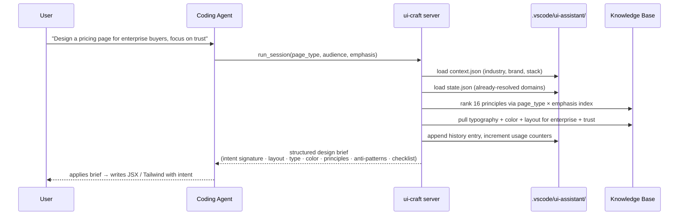
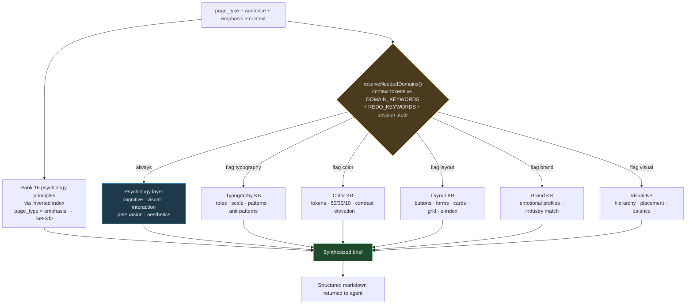
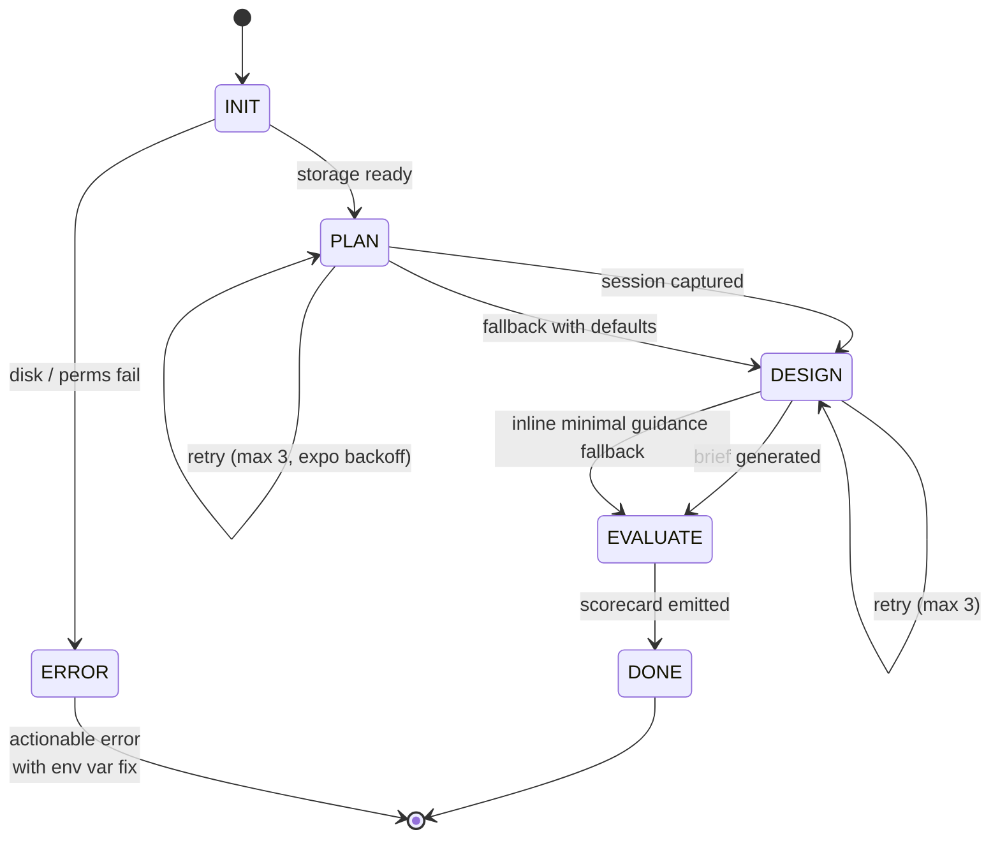
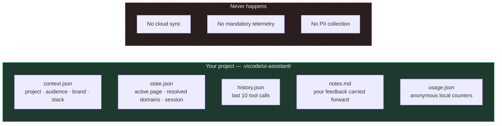
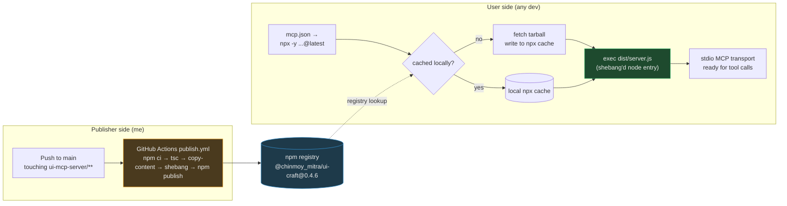

# UI Craft

**A psychology-backed design intelligence layer for AI coding agents, delivered as an open-source MCP server.**

Instead of asking your coding agent to "make it look better," UI Craft gives it a real design brain — 16 cognitive & UX principles, a domain-partitioned knowledge base, and per-project memory — all callable as tools, all running locally, nothing leaving your machine.

---

## At a glance

| | |
|---|---|
| **Type** | Open-source developer tool · Model Context Protocol server |
| **Role** | Sole engineer & designer |
| **Timeline** | May 2026 – present · v0.4.6 shipped, actively maintained |
| **Stack** | TypeScript · Node.js 18+ · MCP SDK · Zod · JSON knowledge base |
| **Distribution** | Public npm package · CI/CD auto-publish on push to main |
| **Compatibility** | GitHub Copilot · Claude Code · Cursor · any MCP-compatible agent |
| **Privacy model** | 100 % local · zero mandatory telemetry · no PII collection |
| **License** | Apache 2.0 |
| **Links** | [GitHub](https://github.com/Chinmoy17/UI_Assitant_AI) · [npm](https://www.npmjs.com/package/@chinmoy_mitra/ui-craft) · [Deep-dive article](./LINKEDIN_POST.md) · [Architecture guide](./ARCHITECTURE.md) |

---

## 1. Problem statement

### The developer's problem

Every full-stack developer I know follows the same anti-pattern: build the backend first, obsess over data models and APIs, then throw a UI on top at the end. The UIs look like toys.

The reason isn't laziness. It's that UI/UX judgment is a large surface area of decisions — layout, typography, color, hierarchy, interaction, motion, copy — and each of those decisions is rooted in cognitive psychology and design research most engineers never encountered in school. Fitts's Law, Hick's Law, Miller's Law, the F-Pattern, Cognitive Load Theory, the Halo Effect — these aren't intuition, they're a body of knowledge.

You can *read* the knowledge. Books, blogs, *Refactoring UI*, *Laws of UX*, research papers. But retention in an active coding session is close to zero. The moment you're deep in JSX, all of it evaporates. You end up steering a very capable AI agent with the vague instruction "make this look better" — and getting a very capable, very vague, still-ugly result.

### Why the existing workarounds fall short

The obvious industry fix is a project-scoped instruction file — `skill.md`, `AGENTS.md`, `.cursorrules`, `copilot-instructions.md`. Dump the design rules into markdown, hope the agent reads it.

Every one of these approaches has the same four failure modes:

| Failure mode | What breaks |
|---|---|
| **Context-window tax** | A serious design guide is 3–5k tokens. Every one of those tokens sits in the agent's context on every turn — whether the current task needs typography advice or not. On long sessions, this crowds out the actual code. |
| **Not adaptive** | A landing page for a fintech dashboard and an onboarding flow for a consumer app need different principles. Halo Effect matters for one, Cognitive Load for the other. A single flat markdown file can't route conditionally. |
| **Doesn't scale across projects** | Every new repo requires re-copying, tweaking, versioning. The rules drift. There's no persistent memory of decisions made or feedback received in a prior session. |
| **Fragile to share** | If I share my `skill.md` with a teammate, they inherit my project's biases — audience, industry, brand, tone. It's a snapshot of my context, not portable knowledge. |

### The gap

There was no distribution mechanism for **persistent, adaptive, context-aware, on-demand, privacy-preserving design intelligence** for AI coding agents. Design tools exist. Design plugins exist. But none of them plug into the modern agent workflow the way `grep`, `read_file`, and `web_search` already do — as a tool the agent calls when it needs it.

---

## 2. Solution

### The core insight

Coding agents already work beautifully with tools. The tool contents don't sit in context — the agent invokes them on demand, gets exactly what it asked for, and moves on. That's the shape a design brain wants:

- **Universal** — one server, any agent, any project.
- **On-demand** — knowledge loaded only when the agent asks.
- **Adaptive** — the same server gives different answers for a B2B dashboard vs a consumer landing page.
- **Stateful** — remembers your project's audience, stack, brand, must-keeps.
- **Private** — everything stays on disk. No cloud calls.

[Model Context Protocol](https://modelcontextprotocol.io) — introduced by Anthropic and now supported by every major coding agent — is exactly that primitive. UI Craft is an MCP server built on it.

### What UI Craft is

A single Node.js process, installed via one line of `mcp.json` config, that registers **seven tools** with the coding agent:

| Tool | Purpose |
|---|---|
| `run_session` | Full orchestrated session: `INIT → PLAN → DESIGN → EVALUATE`. All fields optional; the orchestrator infers what it can from stored context and defaults the rest. |
| `design_page` | Single-shot design brief for a specific page type + emphasis. Returns layout, typography, color, top psychology principles, common mistakes, checklist. |
| `start_session` | MCQ-style onboarding — captures working mode, surface, goal, audience, tone, density, change behavior. Writes to session state. |
| `set_project_context` | Persist project-wide context (industry, audience, brand tokens, stack, must-keeps) so every future recommendation is tailored. |
| `get_project_context` | Read the current stored context. |
| `get_session_state` | Current stage, resolved KB domains, pending questions. |
| `get_usage_stats` | Local anonymous counters — tool calls, page types designed. No PII, never leaves disk. |

Under the hood these tools draw on:

- **16 cognitive & UX principles** grouped into cognitive, visual, interaction, persuasion, and aesthetics categories.
- **A domain-partitioned knowledge base** — typography, color, layout, brand, visual, accessibility, interaction (motion), UX copy, per-industry guidance, and optional encrypted design-system tokens.
- **Per-project persistent state** — audience, industry, brand tokens, device targets, must-keeps, tone, and iterative feedback carried forward.

### Value proposition — in one sentence

Turn every "make this look better" prompt into a structured, evidence-backed design brief the agent can act on with intent — without adding a byte to your context window, without sending anything to the cloud.

---

## 3. Architecture

### High-level system

```mermaid
flowchart TB
    subgraph Client["Developer's machine"]
        Agent["Coding Agent<br/>(Copilot / Claude Code / Cursor)"]
        subgraph MCPProc["ui-craft MCP server (Node process)"]
            Server["server.ts<br/>MCP stdio transport + 7 tools"]
            Orch["Orchestrator<br/>INIT → PLAN → DESIGN → EVALUATE"]
            DP["design_page tool"]
            Store["storage.ts<br/>context + state + history + notes + usage"]
        end
        subgraph KB["Bundled knowledge base"]
            Psych["Psychology layer<br/>16 principles × 5 categories"]
            Domain["Domain KBs<br/>typography · color · layout ·<br/>brand · visual · accessibility ·<br/>interaction · copy · industry"]
        end
        Local["`.vscode/ui-assistant/`<br/>context.json · state.json ·<br/>history.json · notes.md · usage.json"]
    end

    Agent <-->|stdio JSON-RPC| Server
    Server --> Orch
    Server --> DP
    Orch --> DP
    DP --> Psych
    DP --> Domain
    Server <--> Store
    Store <--> Local

    style MCPProc fill:#1e3a4a,stroke:#3498db,color:#eee
    style KB fill:#1e4a2e,stroke:#27ae60,color:#eee
    style Local fill:#4a3a1e,stroke:#f39c12,color:#eee
```

### Component breakdown

**1. MCP server layer** (`src/server.ts`)
Registers all seven tools with the MCP SDK, wires them to a stdio transport, and proactively initializes the storage system before the first request arrives. A custom `registerTool()` wrapper sidesteps a deep-generics compile regression in the SDK (see Engineering section).

**2. Tool logic** (`src/tools/`)
- `design_page.ts` — the single-shot design engine. Loads the KB, ranks principles via inverted indexes, resolves needed KB domains from context, assembles a structured markdown brief.
- `start_session.ts` — MCQ-style session initialization. Maps user answers into internal `PageModel` and `SessionState` types.
- `orchestrator.ts` — the state machine. Runs `INIT → PLAN → DESIGN → EVALUATE → DONE` with retry + fallback per stage. Includes smart input resolution and fresh-start detection.

**3. Knowledge base** (`src/content/`)
Structured as JSON files partitioned by domain. Loaded lazily by domain-specific loaders, cached as singletons, indexed on first use.

**4. Storage layer** (`src/storage/storage.ts`)
Reads/writes the five persistent files under `.vscode/ui-assistant/`. Handles workspace root resolution (env vars → git root → cwd → home fallback) so it works whether the MCP is configured locally or globally.

**5. Optional design-system crypto** (`src/crypto/design_system_crypto.ts`)
Support for encrypted design-system specs, so a team can ship a private brand palette + typography scale to their contractors' agents without exposing tokens.

### Single-call data flow



### The knowledge base as a graph

The naive design would be a folder of JSON files, loaded on every call, filtered in memory. That's what v0.1 did. The current version treats the KB as a **two-layer graph** with an index built once and reused for the entire server lifetime.



**Layer 1 — Psychology principles.** 16 rules across five categories. Always ranked. This is the reasoning lens — *why does this work on a human brain*.

**Layer 2 — Domain KBs.** Typography, color, layout, brand, visual, plus accessibility, interaction motion, UX copy, and per-industry guidance. Individually gated. A KB only loads and only emits into the response if the input signals ask for it.

### Orchestrator state machine



Every stage retries with 50 / 100 / 200 ms exponential backoff. If retries exhaust, the stage emits a structured fallback — never a silent failure. The difference between "the agent got confused and moved on" and "the agent got a partial answer with a note about what went wrong, and kept going."

### Local-first storage



---

## 4. How it works — the underlying protocols

### 4.1 MCP: what it is and why it fits

**Model Context Protocol** is an open specification (originated at Anthropic, adopted by every major agent runtime) for connecting AI assistants to external tools and data. It defines:

- **Transports** — stdio, HTTP+SSE. UI Craft uses stdio because it's the local-first path.
- **JSON-RPC 2.0 message format** — structured request/response between agent and server.
- **A capability model** — tools, resources, prompts. UI Craft ships tools; the KB is baked into the tool implementations, not exposed as MCP resources (deliberate choice — see engineering notes).

The agent doesn't know or care what language the MCP server is written in. It sees a manifest of tool names, descriptions, and JSON schemas for their inputs. When the model decides to call one, the agent runtime marshals the call over the transport and returns the result to the model's context.

Practical implication: UI Craft can be swapped from Copilot to Claude Code to Cursor to any future agent with **zero code changes**. The protocol is the API.

### 4.2 Why npm was the right delivery vehicle

The distribution problem: getting a Node.js process onto a developer's machine, keeping it up to date, respecting security norms, and asking for zero manual setup.

**npm + npx solves all of that.**

- **`bin` + shebang = zero-friction entry.** `package.json` declares `"bin": { "ui-craft": "dist/server.js" }`. A tiny `add-shebang.js` postbuild script prepends `#!/usr/bin/env node` to the compiled entry point. `npx` sees an executable JS file and just runs it — no wrapper scripts, no `PATH` mutation, no launcher.
- **No post-install hooks.** Nothing runs on the user's machine at install time. No native builds. No download-more-stuff scripts. This is a security posture as much as a speed posture — the supply-chain attack surface stays flat.
- **Content ships bundled.** A `copy-content.js` build script walks `src/content/` and mirrors every JSON file into `dist/content/` before publish. When users install the package, they get the entire knowledge base. No runtime fetches, no CDN dependency, no code/data version drift.
- **`@latest` vs pinned version.** Users decide. `npx -y @chinmoy_mitra/ui-craft@latest` fetches the newest tarball whenever the registry has one; `@0.4.6` locks to a known version. `npx` handles cache invalidation transparently.
- **CI is the release button.** `.github/workflows/publish.yml` triggers on any push to `main` that touches `ui-mcp-server/**` — `npm ci` → `npm run build` (`tsc` + `copy-content` + `add-shebang`) → `npm publish`. No manual step, no forgotten `dist/`, no "whoops shipped without content".



First run costs a network round-trip. Every run after that is a cache hit + a Node process spawn — low tens of milliseconds. The entire KB lives inside the tarball, so the moment the process boots it's ready to answer.

### 4.3 Session, context, and the domain-routing algorithm

Every tool call touches three sources of information:

1. **Explicit call arguments** — what the agent passed in.
2. **`context.json`** — persisted project-scoped facts (industry, audience, brand, stack, must-keeps).
3. **`state.json`** — the active session's state (current stage, resolved KB domains, page model).

The orchestrator's `resolveInput()` function merges these sources with a strict priority: explicit args → stored context → inferred from freeform text (using regex-based keyword extractors) → safe defaults. Missing information is filled in without blocking.

The KB router (`resolveNeededDomains()`) tokenizes the user's `context` field against `DOMAIN_KEYWORDS` (which words signal "typography", "color", etc.) and `REDO_KEYWORDS` ("redo color", "revisit typography"). It returns a `DomainFlags` bitmap. In **progressive session mode**, the domains already resolved in `state.json.resolved_domains` are subtracted from the flags before routing — so an already-answered domain doesn't get emitted again unless the user explicitly asks to redo it.

The net effect on iteration: your fifth call on the same page in a session emits a fraction of the tokens the first call did, without losing intent (the Intent Signature block always includes the anchor principles and page/emphasis, keeping the model grounded).

---

## 5. Features and capabilities

### The 7 tools

| Tool | Description | Example prompt (Agent mode) |
|---|---|---|
| `run_session` | Full orchestrated session with retries, fallbacks, and smart input resolution. Start here. | *"Design an onboarding flow for first-time consumers, focused on clarity."* |
| `design_page` | Single-shot design brief. | *"What layout should I use for a settings page focused on speed?"* |
| `start_session` | Structured MCQ onboarding. | *"Start a UI Craft session — I'm redesigning an existing dashboard for admins."* |
| `set_project_context` | Persist project facts. | *"Set project context: industry fintech, audience portfolio managers, primary color #0F52BA, stack Next.js + Tailwind, dark theme."* |
| `get_project_context` | Read stored context. | *"Show me the current UI Craft project context."* |
| `get_session_state` | Introspect session progress. | *"What has UI Craft already resolved for this page?"* |
| `get_usage_stats` | Local anonymous counters. | *"Show my UI Craft usage stats."* |

### The 16 psychology principles

Organized into five categories, each with `dos`, `donts`, `rules`, and `applies_to` page-type tags:

- **Cognitive** — Hick's Law, Miller's Law (7±2), Cognitive Load Theory, Anchoring Bias, Halo Effect.
- **Visual** — Gestalt principles, F-Pattern & reading patterns, Preattentive Visual Processing, Visual Hierarchy, Squint Test.
- **Interaction** — Fitts's Law, Affordance, Feedback Latency.
- **Persuasion** — Social Proof, CTA psychology.
- **Aesthetics** — Typography credibility, Color trust signals, White space & the halo effect on quality perception.

### Domain-partitioned knowledge base

Each domain is a directory of JSON files, individually loadable and cacheable:

- **Typography KB** — role system (`--font-ui`, `--font-display`, `--font-mono`), size/line-height/weight scales, letter-spacing rules, brand reference patterns (Apple, Linear, Stripe, Vercel, and more), anti-patterns with fixes.
- **Color KB** — semantic tokens, background/border/accent roles, 60/30/10 distribution guidance, WCAG contrast quick reference, elevation & shadow system, component focus ring pattern, emphasis-filtered anti-patterns.
- **Layout KB** — button hierarchy & sizing, form patterns (input anatomy, layout patterns), card variants, spacing scale (`space-1` through `space-12`), grid system per breakpoint, page-type max-widths, z-index scale.
- **Brand KB** — emotional profiles of reference brands (Nike, Apple, Meta, Spotify, Airbnb, Stripe) with industry/emphasis matching, design signal decomposition, type & color direction inference.
- **Visual KB** — 12 visual design principles (balance, contrast, emphasis, placement, alignment, movement, white space, proportion, pattern, unity, variety, design ethics).
- **Accessibility KB** — keyboard navigation patterns, ARIA landmarks & roles.
- **Interaction KB** — motion timing scale, easing curves, hover intent, reduced-motion handling. *(This is the section actively being expanded — see Roadmap.)*
- **UX copy KB** — CTA copy rules, error message anatomy, empty-state patterns, toast copy.
- **Industry KB** — per-industry adaptation layer (fintech, healthcare, education, etc.) with design principles, typography, color, layout, components, anti-patterns, page-type emphasis defaults, reference brands.
- **Design system** — optional encrypted spec (see below).

### Optional encrypted design-system spec

For teams shipping their own brand palette + typography + button tokens: a design-system JSON can be encrypted client-side, distributed to contractors, and decrypted at runtime by the MCP server using a workspace-provided key. Enables a company like an internal design-system team to hand contractors a bundle they can *use* without seeing raw tokens or attempting to re-package them.

### Per-project persistent memory

Every session updates:

- `context.json` — long-lived project facts.
- `state.json` — the active `PageModel` (audience, product context, surface, structure, content profile, design signals, interaction signals, evidence, recommendations, open questions) + session state (mode, pending questions, resolved domains).
- `history.json` — last 10 tool calls, so you can review what was decided.
- `notes.md` — free-form iterative feedback ("don't use serif for this brand") that flows into subsequent briefs.
- `usage.json` — anonymous local counters keyed by a random install UUID.

---

## 6. Setup guide

### Requirements
- **Node.js 18+** (`node --version` to check)
- A coding agent that supports MCP: GitHub Copilot in VS Code, Claude Code, or Cursor.

### Fastest install — let your agent do it

Copy this repo URL: `https://github.com/Chinmoy17/UI_Assitant_AI`
Paste into your agent's chat and say:
> "Read this repo's README and set up the MCP server for my workspace."

Modern agents parse the README's setup block, write the correct `mcp.json` file, and prompt you to reload. That's the whole setup.

### Manual install

**VS Code (GitHub Copilot / Claude in VS Code)** — create `.vscode/mcp.json`:
```json
{
  "servers": {
    "ui-craft": {
      "type": "stdio",
      "command": "npx",
      "args": ["-y", "@chinmoy_mitra/ui-craft@latest"]
    }
  }
}
```
Restart VS Code. Flip Copilot Chat to Agent mode.

**Claude Code** — add to `~/.claude/settings.json`:
```json
{
  "mcpServers": {
    "ui-craft": {
      "command": "npx",
      "args": ["-y", "@chinmoy_mitra/ui-craft@latest"]
    }
  }
}
```

**Cursor** — add to `~/.cursor/mcp.json` (Mac/Linux) or `%APPDATA%\Cursor\mcp.json` (Windows):
```json
{
  "mcpServers": {
    "ui-craft": {
      "command": "npx",
      "args": ["-y", "@chinmoy_mitra/ui-craft@latest"]
    }
  }
}
```

### Verify it's running

- `Ctrl+Shift+P` → **MCP: List Servers** — `ui-craft` should show **Running**.
- `Ctrl+Shift+P` → **Chat: Configure Tools** — expand `ui-craft` and see all seven tools.

If missing, check `Output → MCP` in VS Code for server logs.

### Recommended first step

Before asking for a design, seed the context once:

```
Set project context:
- industry: fintech
- audience: portfolio managers
- primary color: #0F52BA
- stack: Next.js + Tailwind + shadcn/ui
- theme: dark
- must keep: existing sidebar navigation and top bar
```

Every future call automatically inherits this context. No repetition.

---

## 7. Real examples

### Example 1 — Landing page, enterprise, trust

**Prompt:**
```
Design a landing page for a B2B SaaS product focused on trust.
Audience is enterprise buyers. Stack is Next.js + Tailwind.
```

**Response (abbreviated — real output is longer):**

```markdown
## Intent Signature
page_type: landing_page | emphasis: trust | mode: greenfield
Anchor principles: Halo Effect · F-Pattern · Miller's Law

## Layout
Hero: H1 + one-sentence value prop + one CTA.
Social proof strip immediately below (logos, no testimonials yet).
3-column feature grid. Pricing anchor. FAQ. Footer CTA.
Max-width 1200px, 12-column grid, 24px gutters.

## Typography
Serif or semi-serif display for headings — signals credibility for
enterprise audiences (Halo Effect via type authority).
Body: 16px / 1.6 line-height / max 65ch.
H1: 48–56px desktop, 32px mobile.

## Color
Primary: deep blue (trust signal, banking / enterprise anchor).
60% neutral surface / 30% primary / 10% accent.
Contrast: body text ≥ 7:1 on background. Never gray-on-gray.

## Top Psychology Principles
### Halo Effect
A single positive trait (visual polish, credible typography) biases the buyer's
perception of every other trait — including trustworthiness of the underlying
product. Investment in visual craft pays back as perceived reliability...

### F-Pattern
Enterprise buyers scan. Top-left quadrant is where trust cues must live —
logo, headline, credibility badge, a compressed value prop...

### Miller's Law
7±2 chunks max. Feature grid: 3 or 6, never 8. Pricing tiers: 3, never 4 or 5.

## Common Mistakes to Avoid
- Multiple competing CTAs above the fold
- Rainbow gradient CTAs (destroys trust for enterprise)
- Body copy under 14px
- Testimonials without a company logo

## Checklist
[ ] Squint test: is the CTA still visible at 20% zoom?
[ ] Contrast passes WCAG AA on all text
[ ] One primary CTA per section, max two
[ ] Social proof visible without scrolling
```

The agent then writes JSX with that brief in hand. Same prompt without UI Craft gets you *"a nice hero section"*. Same prompt with UI Craft gets you a *reasoned* hero section.

### Example 2 — Progressive iteration on the same page

Call 1 (full brief):
> "Design a fintech dashboard for portfolio managers, emphasize clarity."

Response includes full typography, color, layout, brand, and psychology sections.

Call 2 (progressive — same session):
> "Redo the color palette — I need a warmer accent for the alerts panel."

Response includes **only** the color section, updated. Typography, layout, brand are silently skipped because `state.json.resolved_domains` already lists them. The Intent Signature block still shows `page_type: dashboard | emphasis: clarity | anchor principles: F-Pattern · Cognitive Load · Miller's Law` so the model stays grounded.

Result: same iteration count, ~70 % fewer tokens returned, no context loss.

### Example 3 — Existing UI improvement

Prompt:
> "Improve the existing pricing page — it's converting badly. Users bounce after the second tier."

The `working_mode: improve_existing` path activates a different orchestrator branch: analyze evidence (source or prompt description), rank improvements by impact × effort × confidence, propose ranked recommendations with the specific principles/laws they violate. Change behavior can be set to `suggest_only`, `preview_then_ask`, or `auto_apply_safe_changes` to control how aggressively the agent modifies code.

---

## 8. Engineering deep-dive

### The build-cost story (a 150× fix, not a speedup trick)

The MCP SDK's `server.tool(name, desc, shape, handler)` uses deeply generic overloads. Registering seven tools naively triggered **~27.8 million type instantiations**, drove the TypeScript compiler to ~6 GB of memory, and took **~197 seconds** to build. Not a build — a hostage negotiation.

The fix was small and mechanical: a non-generic `registerTool()` wrapper that binds `server.tool` once and re-declares the handler signature explicitly. TypeScript stops trying to infer through the deep generics; the seven `registerTool(...)` calls resolve trivially.

| Metric | Before | After |
|---|---:|---:|
| Build time | ~197 s | **~1.3 s** |
| Peak compiler memory | ~6 GB | **~163 MB** |
| Type instantiations | ~27.8 M | negligible |

This is the kind of fix that only pays off if you actually measure. The tell was that `tsc` would appear to hang, then eventually finish. Left unfixed, iterative development would have been unworkable.

### Cold-start discipline

`initContextSystem()` runs in `main()` before `StdioServerTransport` connects. All five files under `.vscode/ui-assistant/` are guaranteed to exist before the first tool call is even parsed. No first-call latency spike; no half-initialized state visible to the agent.

### Hot-path design

- **Singleton KB loaders.** Zero disk reads after the first hit. Each domain loader has a module-level cache.
- **Three-state cache pattern.** Each cache variable starts as `false` (untried), transitions to `null` (loaded, file was missing on disk), or holds the parsed JSON. Missing files aren't re-checked — no repeated `ENOENT` on every call:
  ```ts
  let _kbTypographySpec: KBTypographySpec | null | false = false
  // false → not attempted yet
  // null  → tried, file absent (won't retry)
  // T     → parsed, cached for the server lifetime
  ```
- **Inverted indexes.** 16 principles indexed once by `page_type × emphasis → Set<id>`. Ranking is a small-set intersection with O(1) `.has()` probes.
- **Term sets, not string scans.** `buildTermSet()` tokenizes freeform context strings once into a `Set<string>`; every subsequent domain check is `.has()`.
- **Synchronous retry with busy-wait.** 50 / 100 / 200 ms backoff. No async overhead because the MCP request chain is synchronous; introducing promises would add scheduling latency for no reliability gain at these delay bounds.
- **Storage writes are diffing.** Each JSON file is only rewritten when its content actually changes — reduces spurious `.vscode/` git diffs.

### Output cost — the currency that matters most

Every KB section emitted becomes a permanent tenant of the agent's context. On a five-call design iteration, the difference between five full briefs and one full brief + four focused diffs is the difference between a bloated context and a clean one.

Progressive session mode is the anti-tax. After the first `run_session` resolves typography for a page, subsequent calls on the same page skip the entire Typography KB section unless the user says `redo typography`. The Intent Signature block at the top of every response acts as the compact reminder: same page, same emphasis, only the new domain got recomputed. The model's attention stays on the current question instead of re-parsing the same font-scale table five times.

### Storage-root resolution — the "global vs local install" problem

MCP configs can live in a specific workspace (`.vscode/mcp.json`) or in global VS Code settings. When installed globally, a naive server would write its state files under wherever `npx` ran — usually the npm cache directory — not the user's project.

`resolveWorkspaceRoot()` walks a fallback chain:

1. `UI_CRAFT_STORAGE_DIR` (explicit override)
2. `UI_CRAFT_WORKSPACE_DIR` (explicit workspace root)
3. `INIT_CWD` (set by npm when invoked from a project)
4. Git-root detection (walks up from cwd looking for `.git/`)
5. Filtered `process.cwd()` (skips npm cache paths via `isLikelyInstallPath()`)
6. `~/.ui-craft/global/` (last-resort fallback)

Result: even users who configure UI Craft globally in VS Code get per-project context, per-project history, per-project notes. The context genuinely follows the code.

### Ethical usage analytics

`usage.json` tracks tool calls and page-type counts locally, keyed by a random `install_id` UUID stable per install location (**not** a user identifier). This is what `get_usage_stats` returns.

Optional remote telemetry is available via a single env var: `UI_CRAFT_TELEMETRY_URL`. Off by default. When enabled, sends anonymous counters over HTTPS with a 3-second timeout, fire-and-forget. Payload contains version, install_id, page_type, emphasis, stage_count, success flag. **Zero PII**, no request paths, no timestamps beyond ISO dates.

### Automated testing

A custom test runner (`scripts/test-tools.js`) exercises all 7 tools plus a full 9-step case study, with 80 assertions across 13 sections. Catches regressions in:
- Tool registration
- Input validation (Zod schemas)
- KB loading & indexing
- Principle ranking
- Domain routing (including redo signals)
- Progressive session mode transitions
- Storage read/write cycles
- Orchestrator retry & fallback paths

Runs via `npm test`. CI runs it on every push to `main` before the publish step.

---

## 9. Advantages over alternatives

### vs. `skill.md` / `AGENTS.md` / `.cursorrules` files

| | `skill.md` | UI Craft |
|---|---|---|
| Context-window cost per turn | 3–5k tokens always resident | 0 tokens until called |
| Adapts to page type | No — one flat file | Yes — principle ranking + KB routing |
| Persists project memory | No — file overwrites reset it | Yes — 5 files, 10-entry history |
| Shareable across projects | Fragile — bakes in your biases | Yes — the KB is universal, context is per-project |
| Iteration feedback loop | Manual re-edit | Automatic — feedback goes into `notes.md` |
| Requires editing config per project | Yes | No — one universal MCP config |

### vs. copying design guidelines into a system prompt

Even worse than a `skill.md` — the tokens are non-negotiable and the guidelines drift silently. UI Craft isolates the design brain into a callable tool that emits *just the relevant slice* on demand.

### vs. commercial design AI tools (Figma AI, v0, etc.)

Different category. Those generate designs or code. UI Craft educates the coding agent so **your** agent generates better code, with the reasoning trail. It doesn't compete with them; it complements them — you can feed a v0 or Figma output back through UI Craft to critique against psychology-backed rules.

### vs. writing your own MCP server

UI Craft is fully open source — this repo is the reference implementation for a KB-backed MCP server with local storage, an orchestrator state machine, progressive session mode, and a CI publish pipeline. It's also directly extensible: `ARCHITECTURE.md` documents exactly how to add a new tool, a new KB domain, or a new principle.

---

## 10. Impact & measurable wins

### Engineering wins
- **Build time reduced from ~197 s to ~1.3 s** via the `registerTool()` wrapper fix (see Engineering section) — a >150× improvement, unlocked iterative development.
- **Zero disk reads on the hot path** after the first call — all KB access goes through the singleton three-state cache.
- **Sub-millisecond principle ranking** via precomputed inverted indexes over page_type × emphasis.
- **Monotonically shrinking response size** across a design iteration — the fifth call on the same page returns a fraction of the tokens of the first, without losing intent.

### Product wins
- **7 tools** covering the full "understand → design → iterate" loop.
- **16 psychology principles** across 5 categories, indexed for O(1) ranking.
- **10 knowledge domains** (typography, color, layout, brand, visual, accessibility, interaction, copy, industry, design system) individually loadable, individually cached, individually routable.
- **5-file local storage system** with automatic workspace-root resolution across local *and* global MCP installs.
- **80 automated tests** across 13 sections, gating every push to main.

### Distribution wins
- **Published to npm as `@chinmoy_mitra/ui-craft`.**
- **CI/CD auto-publish** on push to main — zero manual steps between commit and shipped version.
- **Zero-install user setup** — `mcp.json` one-liner + `npx` handles the rest.
- **No post-install scripts, no runtime downloads, no cloud dependencies** — supply-chain-clean.

### Why this matters beyond me
The pattern this establishes — an MCP server that packages domain expertise (design knowledge) as a callable tool with local persistence and adaptive routing — is generalizable. The same shape works for legal domain knowledge, medical, finance, security, accessibility auditing, database best practices, and more. UI Craft is a reference implementation others can fork.

---

## 11. Tech stack

| Layer | Choice | Why |
|---|---|---|
| Language | TypeScript 5.4 | Strong types over a JSON knowledge base + safe input schemas via Zod. |
| Runtime | Node.js 18+ | Universal reach; no native deps; matches MCP SDK. |
| Protocol | Model Context Protocol (stdio) | Native to every modern coding agent; local-first by default. |
| SDK | `@modelcontextprotocol/sdk` ^1.12 | Official implementation; tracks spec updates. |
| Input validation | Zod ^3.23 | Runtime schema + inferred TS types in one declaration. |
| Storage | JSON files in `.vscode/ui-assistant/` | Human-readable, git-friendly (opt-in), zero dependencies. |
| Build | `tsc` + custom postbuild (`copy-content.js`, `add-shebang.js`) | Two tiny scripts replace an entire bundler. |
| Distribution | npm registry + `npx` | Cross-platform, cached, versioned, `@latest` semantics. |
| CI/CD | GitHub Actions (`publish.yml`) | Push to main → auto-publish; secret-scoped `NPM_TOKEN`. |
| Testing | Custom Node test runner (`scripts/test-tools.js`) | Integration tests over the whole tool surface; no framework overhead. |
| Optional crypto | Node `crypto` module (AES-GCM) | Encrypted design-system spec for private brand tokens. |

---

## 12. Related work in this repo

### `ui-psychology-lab/` — interactive educational SPA

A React + Vite + Tailwind CSS v4 application that walks a developer through the same 14–16 principles UI Craft encodes, with live interactive demos: Fitts's Law click test, Hicks Law choice load simulator, F-pattern reading tracker, squint test, gestalt grouping demos, and more. Runs as `npm run dev` from `ui-psychology-lab/`.

Two purposes:
- **Learning tool** — for developers who *want* to internalize the principles, not just delegate them to an agent.
- **Content source** — the demos and copy inform the KB entries UI Craft ships.

### `docs/` — engineering journal

- `JOURNAL.md` — dated development log with problem/thinking/solution structure for every session.
- `phase_plan.md` — the phased delivery plan (Phase 0–7) and completion state per phase.
- `current_issues.md` — known architecture gaps and their fix strategies. This is the running "what's next" ledger.

---

## 13. Roadmap

**Shipped (v0.4.6):**
- ✅ `design_page` with page_type × emphasis × audience × industry × device adaptation
- ✅ `run_session` orchestrator with retries and structured fallbacks
- ✅ `start_session` MCQ onboarding
- ✅ Persistent per-project context
- ✅ Session state introspection
- ✅ Local anonymous usage stats
- ✅ Domain-gated KB with progressive session mode
- ✅ CI/CD auto-publish to npm
- ✅ 80-test automated suite
- ✅ Design-system encryption support

**Next up:**
- [ ] **Transitions & animation KB** — motion timing, easing, reduced-motion, hover intent, page-type micro-interactions. *(Biggest current gap — actively looking for a motion designer collaborator.)*
- [ ] `analyze_ui` — score an existing JSX/HTML surface for hierarchy, contrast, grouping, density, affordance.
- [ ] `improve_ui` — turn "make this better" into concrete, ranked, reasoned moves with impact × effort × confidence scoring.
- [ ] `choose_palette` — brand-mood → color-system generator.
- [ ] `accessibility_check` — WCAG contrast + keyboard navigation review.
- [ ] Remote-hostable server for browser-based agents (claude.ai and similar).

---

## 14. Reflection — what I learned

**Distribution matters more than features.** The single biggest unlock was the `npx @latest` pattern. It reduced install friction from "clone this repo, `npm install`, edit a config, add to PATH" to *one line of JSON*. That's not a feature — it's a delivery decision, and it made everything downstream possible.

**Measurement finds fires.** The 197 s → 1.3 s build fix was invisible until I benchmarked. Coding agents accelerate output but they don't automatically surface performance regressions — you still have to look.

**Context is the actual currency.** I started this project focused on *what to teach the agent*. I finished it focused on *when to teach the agent*. Progressive session mode, domain gating, and the Intent Signature block are all answers to the same question: how do I keep the model's attention on the current task without amnesia and without spam?

**MCP is the right primitive for domain expertise packaging.** The pattern generalizes. Anywhere you have a body of professional judgment that would otherwise live in a Google Doc or a Notion page, MCP + an adaptive KB is a better home.

**Open source is a design constraint that helped.** Every "should this be private?" question defaulted to *no, ship the JSON, someone will improve it*. That's why the KB is JSON and not a database, why the orchestrator state is markdown-serializable, why the crypto is opt-in.

---

## 15. Links

- 📦 npm — https://www.npmjs.com/package/@chinmoy_mitra/ui-craft
- 🐙 GitHub — https://github.com/Chinmoy17/UI_Assitant_AI
- 🐛 Issues — https://github.com/Chinmoy17/UI_Assitant_AI/issues
- 📖 Deep-dive article — [LINKEDIN_POST.md](./LINKEDIN_POST.md)
- 🏗️ Architecture guide — [ARCHITECTURE.md](./ARCHITECTURE.md)
- 🧠 Model Context Protocol — https://modelcontextprotocol.io

---

## 16. Credits

- **Israt Moyeen Noumi** — constant QA and honest testing across releases.
- **Mehedi Hasan Nipu** — brainstorming partner from day one; sanity check on architecture calls.
- **Tarannum Ahmed Nowshin** — always-positive energy that kept momentum on the long weeks.

---

*Built by Chinmoy Mitra. Apache 2.0 licensed. Not a startup — a tool I wished existed.*
